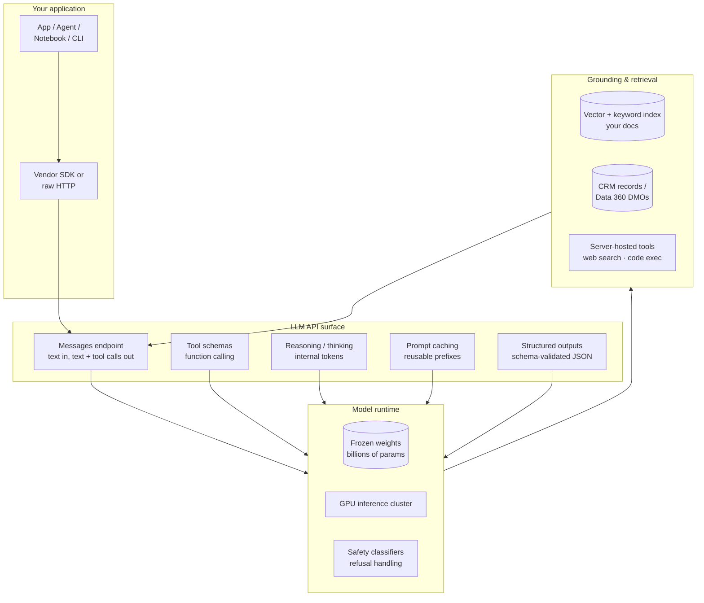
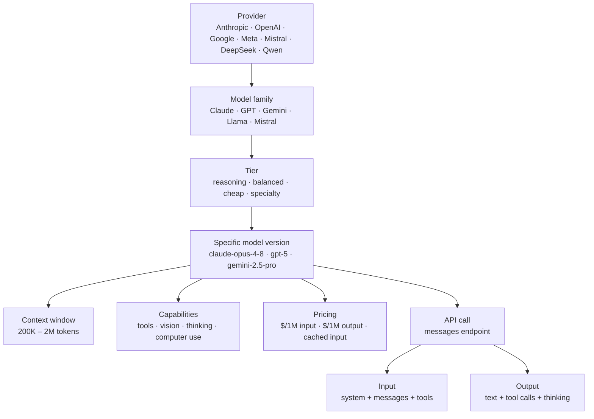
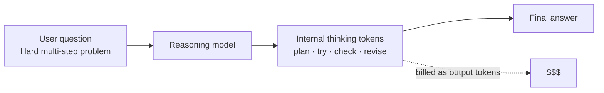
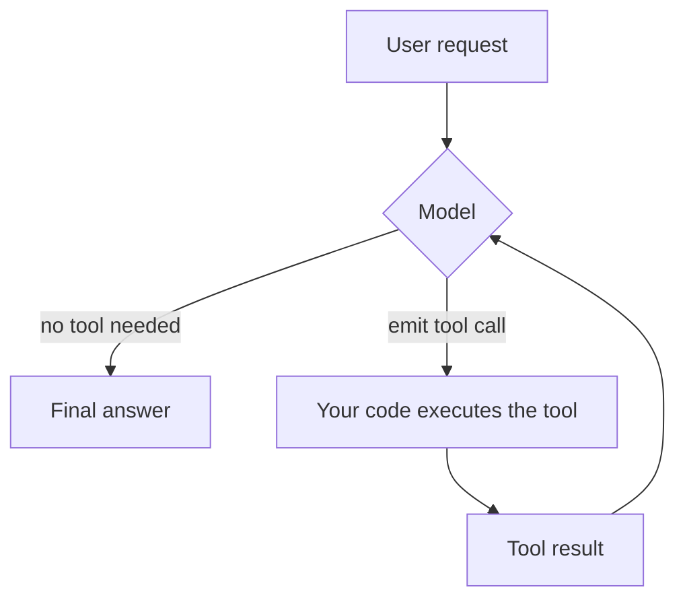
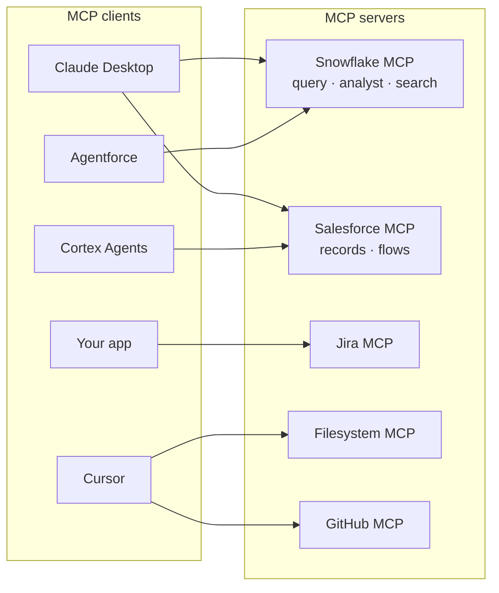
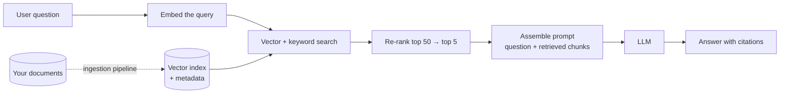
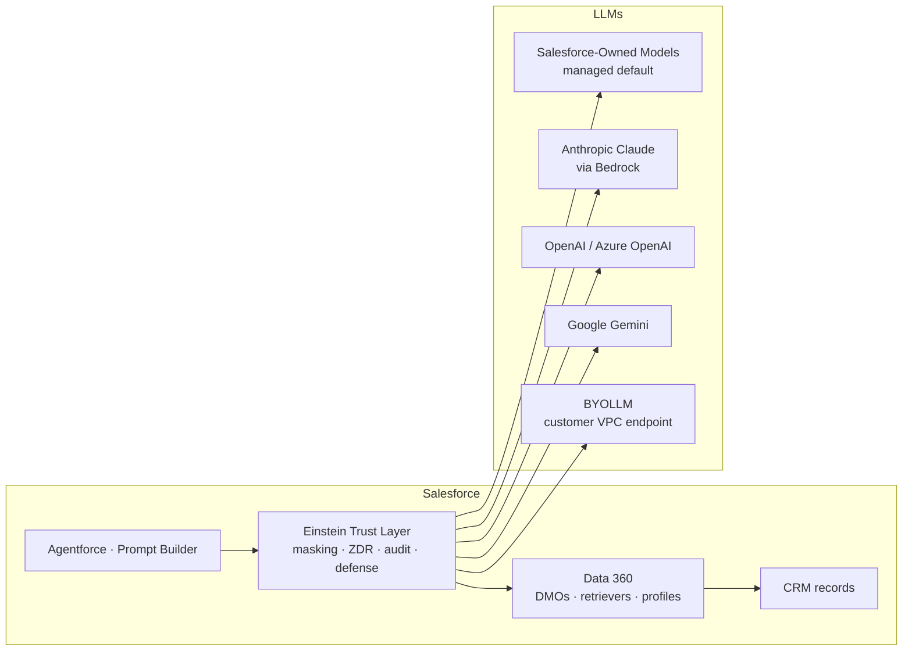

# LLM 101 — concepts, enterprise positioning & the API surface worth knowing

A quick-reference for the concepts that explain most day-to-day work with Large Language Models, plus the API shapes and integration patterns worth keeping at your fingertips. Generic — swap in your own models, tools, and data.

> **Naming note:** the field re-labels itself every few months. "Foundation model" and "LLM" are used interchangeably in most enterprise contexts. "Reasoning model" is a subset of LLMs that spend internal thinking tokens before answering (Claude Opus/Fable/Sonnet 4.6+, GPT-5, Gemini 2.x thinking, DeepSeek R1). "Agent" is a loop pattern built on top of an LLM, not a separate class of model. Where this guide says "model," it means an LLM behind an API — hosted or self-hosted.

---

## The mental model in one line

**An LLM is a stateless function `text → text` (plus optional tool calls) that runs on a vendor's GPUs and bills you per token.** Everything else — prompt engineering, RAG, tool use, agents, fine-tuning, safety layers — is either shaping the input, shaping the output, or looping the function against tools and data. Once you internalize "stateless function, billed per token, wrapped by an API surface with a few first-class features," the whole ecosystem stops looking mysterious.



The diagram is the whole pitch: your app calls one HTTP endpoint. The model is stateless — every call ships the full conversation. Everything interesting (RAG, agents, tool use, memory) is code you write around that call, wired into the platform features the vendor exposes.

---

## What an LLM is

A **Large Language Model** is a transformer-architecture neural network trained on trillions of tokens of text and code. Its parameters (weights) encode statistical patterns of language, code, and world knowledge. At inference time, it takes an input sequence of tokens and produces a probability distribution over the next token, then samples from that distribution — repeatedly, one token at a time, until it hits a stop condition.

A simple way to explain it to enterprise teams:

> An LLM is a rented statistical text engine. You send it a conversation plus optional tool schemas and constraints; it sends back the next assistant turn plus optional tool calls. It has no memory between calls, no access to your data unless you put it in the prompt, and no ability to take real-world actions unless you give it tools.

The three shifts from the pre-LLM ML era:

* **General-purpose** — one model handles classification, extraction, summarization, translation, code generation, and reasoning. No task-specific model.
* **Prompt-driven** — behavior is shaped in-context by instructions and examples, not by training a new classifier.
* **Generative and probabilistic** — output is sampled, so the same prompt returns different outputs (unless you fix temperature/seed). Determinism is not free.

---

## How LLMs differ from traditional ML

| Area | Traditional ML pattern | LLM pattern |
|---|---|---|
| Task binding | One model per task; features engineered per task. | One model handles many tasks; task specified in the prompt. |
| Training | Supervised on labeled data specific to the task. | Pre-trained on massive unlabeled text; task-adapted via prompting, RAG, or fine-tuning. |
| Data volume | Thousands to millions of labeled examples per task. | Trillions of pre-training tokens; often *zero* task-specific examples. |
| Iteration | New task → new dataset → new training run. | New task → new prompt; ship in minutes. |
| Compute | Small models train on CPUs or one GPU. | Frontier models train on thousands of accelerators for weeks; inference still needs GPUs. |
| Determinism | Same input → same output. | Sampled — same input can give different outputs unless temperature is 0 or a seed is set. |
| Evaluation | Precision/recall/F1 against a labeled test set. | Task-dependent: exact-match, LLM-as-judge, human rubrics, downstream metric. |
| Hosting | Ship a model file; run it anywhere. | Frontier models are API-only; open-weight models can be self-hosted with real GPU capacity planning. |

The important nuance: LLMs remove a lot of task-specific training work, but they do **not** remove data engineering, evaluation, or safety work. You still need retrieval infrastructure, prompt evals, guardrails, cost controls, and monitoring.

---

## Enterprise value proposition

LLMs are strongest when a business has many tasks that touch unstructured text — customer conversations, documents, code, knowledge articles, tickets — and wants intelligence in the path of everyday workflows.

Common enterprise benefits:

- **Task consolidation:** One general model absorbs work that used to require dozens of narrow classifiers.
- **Speed to value:** New use case → new prompt → live in a sprint, not a quarter.
- **Language coverage:** Frontier models handle 50+ languages competently without per-language training.
- **Grounded copilots:** Sitting an LLM behind retrieval over your knowledge base gives users answers that cite sources.
- **Agentic workflows:** Loop the model against tools (SQL, APIs, browsers) to automate multi-step tasks — case triage, research, code changes, data analysis.
- **Structured extraction:** Turn free-text emails, PDFs, and transcripts into structured records with schema-validated outputs.
- **Developer productivity:** Code generation, review, refactoring, and debugging inside the IDE.
- **Content operations:** Draft, translate, and summarize marketing, support, and product content at scale.
- **In-platform AI:** Snowflake Cortex, Salesforce Einstein/Agentforce, Databricks, and hyperscaler AI services bring LLMs inside existing governance perimeters.

LLMs are not automatically cheap. Cost management is real work: prompt caching, model tiering (cheap model for easy calls, frontier for hard ones), context-window discipline, request batching, and evals to prevent silent quality regressions.

---

## Core concepts

The mental hierarchy in one picture:



Note that **the model version is what actually determines cost and behavior**, not the family. `claude-haiku-4-5` and `claude-opus-4-8` are the same family but have 5× the price difference and very different capability profiles. Pin exact model IDs in production; don't rely on aliases that vendors reroute.

**Token** — the unit of billing and of context. Roughly 3–4 characters of English per token; code and non-Latin scripts tokenize less efficiently. Every input character, every output character, and every internal thinking token counts. Count tokens with the vendor's counting endpoint before batch operations.

**Context window** — the maximum number of tokens (input + output) the model can hold in a single call. Current frontier models are 200K–2M. Quality degrades near the top of the window ("lost in the middle"); prefer retrieval over dumping everything.

**Max output tokens** — a separate cap on how much the model can *generate* in one response, usually 8K–128K. Reasoning models spend output tokens on internal thinking too, so budget higher for hard problems.

**Temperature** — controls sampling randomness. `0` is nearly deterministic; `1.0` is the model's natural distribution; `>1` amplifies randomness. Reasoning models often ignore temperature during the thinking phase.

**Top-p (nucleus sampling)** — restricts sampling to the smallest set of tokens whose cumulative probability ≥ `top_p`. Usually leave at `1.0`.

**System prompt** — the top-level instruction that stays stable across a conversation. Anthropic puts it in a top-level `system` field; OpenAI puts it as the first message. Order stable content first so it can be cached.

**Messages** — the conversation history. Roles are `user`, `assistant`, and (in modern APIs) `tool` / `tool_result`. Every call ships the full history — the model is stateless.

**Tool / function calling** — you declare functions with JSON Schema; the model decides when to call them, with what arguments; your code executes them and returns results; the model incorporates the results. This is what turns an LLM from a chat toy into an orchestrator.

**Extended thinking / reasoning** — internal tokens the model generates before its final answer, controlled by `thinking` (Anthropic) or `reasoning.effort` (OpenAI) or `thinking_budget` (Gemini). Higher effort improves hard-problem accuracy at real token cost.

**Structured outputs** — vendor-enforced JSON-schema conformance for responses and tool arguments. Replaces the old "please respond as JSON, thanks" prompting hack.

**Prompt caching** — reusing tokenized prefix content (system prompt, docs, tool schemas, few-shot examples) at ~10% of normal input cost. Requires ordering stable content first.

**Streaming** — receive tokens/events as they are produced instead of waiting for the full response. Essential for long generations and to avoid request timeouts.

**Embeddings** — a separate model that turns text into a fixed-dimension vector (usually 768–3072 dims). The building block of vector search and RAG. Embedding models are cheap and distinct from the chat model.

**Stop reason** — how the response ended: `end_turn`, `max_tokens`, `stop_sequence`, `tool_use`, or (Claude Fable 5) `refusal`. Always check before reading `content`.

**Session context** — for chat UIs and agents, your application maintains conversation state across calls. The *model* remembers nothing between requests; the *application* is responsible for storing and re-sending the history.

---

## Reasoning models — the biggest shift since GPT-4

Since late 2024, frontier models split into two tiers: **non-reasoning** (fast, cheap, deterministic-ish — Haiku 4.5, GPT-5 mini, Gemma, Phi) and **reasoning** (spend internal thinking tokens before answering — Claude Opus/Fable/Sonnet 4.6+, GPT-5, Gemini 2.x thinking, DeepSeek R1).



The practical implications:

- **Chain-of-thought is now automatic.** "Let's think step by step" does nothing on a reasoning model — it already does that internally.
- **Effort dial.** Anthropic exposes `low`, `medium`, `high`, `xhigh`, `max`. Higher tiers dramatically improve hard-problem accuracy at 5–20× the cost.
- **Latency.** Reasoning calls can take 30–120+ seconds. Stream, and budget UX around it.
- **Replay rules for agents.** Thinking blocks must be returned on the same model to preserve reasoning across a multi-turn agent loop. A different model on the next turn drops them.
- **When to use.** Hard multi-step problems: complex extraction, code review, math, root-cause analysis, agent planning. Not for classification, simple Q&A, or high-throughput tasks — use a non-reasoning tier.

---

## Tool use and the agent loop

Tool use turns the LLM from a text generator into an orchestrator. This is the single most important architectural pattern in the current era.



The loop runs until the model stops emitting tool calls or a budget is hit. That is what makes Claude Code, Cursor, Devin, Agentforce, Cortex Agents, and Anthropic's Managed Agents possible.

Practical concerns:

- **Loop control.** Cap max steps, max tokens, wallclock, and cost. Runaway agents are a real failure mode.
- **Task budgets.** Anthropic exposes an explicit token budget (`taskBudget`) that stops the agent when hit.
- **Parallel tool calls.** Modern models emit multiple tool calls in one turn when they are independent. Handle them concurrently.
- **Server-hosted tools.** Anthropic and OpenAI ship built-in tools (web search, web fetch, code execution, computer use) that run on the vendor's infrastructure so you don't have to host them.
- **Approval gates.** For high-risk tool calls (writes, external side-effects), pause the loop for human approval before executing.
- **Compaction.** Long-running agents overflow context; Anthropic's Managed Agents and Claude Code auto-compact by summarizing older turns. Custom loops should do the same.

---

## MCP — the tool-integration standard

The **Model Context Protocol** (MCP) is an open protocol (originated by Anthropic, now broadly adopted) that standardizes how *any* application connects to *any* set of tools and data sources.



Instead of writing a bespoke integration per client × per tool, you build one MCP server and every MCP-aware client can consume it. Salesforce Agentforce, Snowflake Cortex Agents, and Anthropic's Managed Agents all speak MCP — cross-platform tool use is the direction of travel, not one winning agent runtime.

Architect concerns:

- An MCP server is a new API perimeter. Auth, authz, audit, and rate limits all apply.
- Least-privilege matters — a Data 360 MCP server that hands agents access to unified profiles needs the same permission scoping as any other Data 360 consumer.
- Not every tool needs MCP. Bespoke first-party tools defined per-request in the `tools` array are fine for single-application use cases.

---

## RAG — retrieval-augmented generation

RAG is the "give the model the docs it needs, retrieved on demand" pattern. It's how you get grounded answers over your knowledge base, product docs, CRM records, or long-tail content the model never saw during training.



What separates a demo from production RAG:

- **Semantic chunking** — split on section boundaries, preserve headings, use overlap. Fixed 500-token windows are a starter, not a finisher.
- **Hybrid retrieval** — vector similarity + keyword (BM25). Pure vector search misses exact matches (product SKUs, IDs, error codes).
- **Re-ranking** — retrieve top 50–100, then use a cross-encoder to pick top 5–10. Retrieval quality jumps here.
- **Metadata filtering** — always retrieve within the caller's authorization scope. Non-negotiable in multi-tenant settings.
- **Freshness** — embed on write, not on read. Real ingestion pipeline with drift monitoring.
- **Citations** — return which chunks supported the answer. Drives trust, debuggability, and evals.

**Agentic RAG.** Modern RAG is increasingly agent-shaped: the model calls a `search()` tool, evaluates results, decides whether to re-query, and only answers when it has enough evidence. Cortex Agents, Agentforce grounding, and Anthropic's Managed Agents all do this under the hood.

---

## Fine-tuning — when to reach for it

Fine-tuning changes how the model *behaves*; RAG changes what it *knows*. Prompt engineering is the first move; fine-tuning is the last.

| Approach | Changes | Cost | Update cadence |
|---|---|---|---|
| **Prompt engineering** | The instruction | Free | Instantly |
| **RAG** | Available knowledge | Moderate — retrieval infra | Real-time |
| **LoRA / QLoRA fine-tuning** | Style, format, narrow skill | Weeks + hosting | Weeks/months |
| **Full fine-tuning** | Deep behavior | Very high | Rare |
| **Continued pre-training** | Language understanding | Very high, rare use | Very rare |

Modern fine-tuning is almost always **parameter-efficient**: LoRA (train small rank-decomposition adapters on top of frozen base weights), QLoRA (LoRA on a 4-bit quantized base — fine-tune 70B on one GPU), DoRA and other variants. Post-training beyond supervised fine-tuning uses **DPO** (Direct Preference Optimization), which has largely replaced PPO-style RLHF for enterprise use.

Hosted fine-tuning options that don't require MLOps in-house:

- **OpenAI fine-tuning API**
- **Anthropic fine-tuning** (select models, via partnerships / Bedrock)
- **Google Vertex AI tuning**
- **Snowflake Cortex fine-tuning** — data never leaves the Snowflake perimeter
- **Salesforce Model Builder** — inside the Einstein Trust Layer perimeter, on Data 360 data

Fine-tuning is not a fix for hallucination. It is the right lever for tone, format compliance, structured extraction, and internal-jargon fluency.

---

## Deployment options

Where the model runs is an architecture decision with real cost, latency, security, and compliance consequences.

| Option | Runs on | You manage | You pay | Fits when |
|---|---|---|---|---|
| **Vendor-hosted API** (Anthropic, OpenAI, Gemini, Grok) | Vendor cloud | Nothing | Per-token | Fastest to prod; frontier models |
| **Cloud-provider hosted** (Bedrock, Vertex, Foundry) | Your cloud tenancy | IAM, network | Per-token + egress | Data residency contracts |
| **Managed OSS inference** (HF Endpoints, Together, Fireworks, Groq, Cerebras) | Vendor cloud | Model choice | Per-token or per-hour | Open-weight without GPUs |
| **In-VPC hosted OSS** (vLLM/TGI on your GPUs, SageMaker) | Your VPC | Infra, autoscaling | GPU hours | Regulated data can't leave tenancy |
| **In-platform embedded** (Snowflake Cortex, Salesforce Einstein, Databricks) | Data-platform tenancy | Little | Credits/metered | Data already lives there |
| **On-device / edge** (Ollama, llama.cpp, Apple/Windows on-device SDKs) | User device | App packaging | Zero token cost | Offline, low latency, small models |

**Decision heuristic:**

- Frontier quality + speed to market → vendor-hosted API.
- Enterprise procurement or data residency with a hyperscaler → cloud-provider hosted.
- Cost dominates *and* you have MLOps capacity → managed OSS or in-VPC.
- Data can never leave the data platform → in-platform embedded.
- Fully offline UX → on-device.

---

## LLM API — the shape worth knowing

Modern LLM APIs cluster around two shapes. Which one you write against matters more than which model you pick.

**Anthropic Messages API:**

```json
POST /v1/messages
{
  "model": "claude-opus-4-8",
  "max_tokens": 4096,
  "system": "You are a helpful Salesforce solution architect.",
  "messages": [
    { "role": "user", "content": "How would you design ..." }
  ],
  "thinking": { "type": "adaptive" },
  "output_config": { "effort": "medium" },
  "tools": [ /* JSON schemas */ ],
  "stream": true
}
```

**OpenAI Responses API:**

```json
POST /v1/responses
{
  "model": "gpt-5",
  "input": [
    { "role": "system", "content": "You are a helpful assistant." },
    { "role": "user",   "content": "..." }
  ],
  "max_output_tokens": 4096,
  "reasoning": { "effort": "medium" },
  "tools": [ /* function schemas */ ],
  "stream": true
}
```

The legacy OpenAI Chat Completions shape (`gpt-4o-mini` with `frequency_penalty` / `presence_penalty`) still works but new features (built-in tools, extended thinking, computer use, MCP connectors, richer structured outputs) ship on the Responses API and Anthropic's Messages API — not on Chat Completions. Build new integrations against the current surfaces.

---

## Important LLMs (Jan 2026 snapshot)

The frontier moves fast; assume this list has a shelf life of months.

**Closed-weight frontier — API/hosted only:**

| Model family | Vendor | Context | Notable |
|---|---|---|---|
| Claude Fable 5 / Mythos 5 | Anthropic | 1M | Anthropic's most capable widely released model; thinking always on |
| Claude Opus 4.8 / 4.7 / 4.6 | Anthropic | 1M | High-capability reasoning + agentic; strong at coding + computer use |
| Claude Sonnet 4.6 | Anthropic | 1M | Balanced production workhorse |
| Claude Haiku 4.5 | Anthropic | 200K | Cheap fast tier; still supports tools & caching |
| GPT-5 family | OpenAI | ~400K | Reasoning-first; Responses API |
| Gemini 2.x / Ultra | Google | 1M–2M | Very long context; strong multimodal |
| Grok 3 / 4 | xAI | 128K–256K | Real-time X signal grounding |

**Open-weight — download and host or use via managed OSS inference:**

| Model family | Vendor | Sizes | Notes |
|---|---|---|---|
| Llama 3 / 4 | Meta | 8B, 70B, 405B; Llama 4 multimodal + MoE | De facto open-weight baseline |
| Mistral Large/Medium/Small/Nemo + Mixtral MoE | Mistral AI | 12B–123B + MoE | Strong multilingual; permissive licenses |
| DeepSeek V3 / R1 | DeepSeek AI | 236B–671B MoE (~37B active) | R1 is a strong open reasoning model |
| Qwen 3 | Alibaba | 0.5B–72B + MoE | Strong multilingual and coding |
| Gemma 2 / 3 | Google | 2B–27B | Small-model on-device tier |
| Phi 3 / 4 | Microsoft | 3.8B–14B | Small-model quality leaders |

Parameter count is a weak proxy for capability on closed frontier models. Compare on benchmarks — and better, on your own evals.

---

## LLMs and Salesforce mental model

Salesforce, Data 360, and LLMs solve different problems and integrate at specific seams.

- **Salesforce CRM** — operational system of engagement: records, workflows, security, UI.
- **Salesforce Data 360** — the data and customer-context layer: DLOs, DMOs, harmonization, identity, segments, agent grounding.
- **LLM (hosted or BYOLLM)** — the reasoning engine; called *through* the Einstein Trust Layer.
- **Einstein Trust Layer** — the enforcement layer between Salesforce data/UI and any LLM.

A practical pattern:

> Salesforce runs the customer/business process. Data 360 harmonizes and grounds the customer/entity data. The LLM reasons over grounded content and can call tools (Apex, Flow, MuleSoft, Snowflake Cortex, MCP servers) through the Trust Layer. Fine-tuning, if needed, happens in Model Builder against Data 360 data without exporting it.

### LLM / Salesforce equivalents

| LLM concept | Closest Salesforce equivalent | Notes |
|---|---|---|
| System prompt | Prompt Template instructions | Reused across many calls; grounded at run time. |
| Grounded prompt | Prompt Template + Data 360 resolvers | Dynamic grounding pulls CRM + Data 360 data with the caller's permissions. |
| RAG retriever | Data 360 retrievers over unstructured content | Knowledge articles, files, external docs indexed for retrieval. |
| Tool / function | Agentforce action (Apex, Flow, MuleSoft, MCP tool) | Model chooses which action to invoke and with what args. |
| Agent loop | Agentforce agent | Managed loop, tools = actions, memory = agent context. |
| Fine-tune | Model Builder (AI Models, formerly Einstein Studio) fine-tune on Data 360 data | Stays inside Salesforce perimeter. |
| Prompt/response logging | Einstein Trust Layer audit trail | Every prompt, response, and score logged. |
| Provider governance | Trust Layer (ZDR, masking, toxicity, prompt defense) | Applied regardless of which LLM sits behind the feature. |

### Where the LLM plugs in



### BYOLLM vs Hosted — quick recommendation

- **Default: hosted** (Salesforce-managed or hyperscaler-hosted frontier model behind the Trust Layer).
- **BYOLLM** only when regulation forces the model to run in a specific VPC, or you have a proven fine-tuning advantage, or volume × pricing math clearly favors self-hosting.
- **LLM Open Connector** makes onboarding a new OpenAI-compatible endpoint a config change rather than a code change.

---

## Gotchas worth knowing early

1. **The model is stateless.** Every call ships the full conversation. There is no server-side memory unless *your* application persists and re-sends it (or you use a Managed Agent surface that does this for you).
2. **Tokens ≠ words.** ~3–4 characters per token for English; less for code and non-Latin scripts. Count tokens, not characters or words, when you care about cost or fit.
3. **Context is not free real estate.** Quality degrades near the top of the window; retrieved context in the middle can be ignored. Prefer RAG over dumping.
4. **Temperature is not the only randomness knob.** Sampling is inherently probabilistic. Set temperature to 0 (or use a seed) if you truly need determinism, and expect the frontier model to still vary slightly.
5. **Reasoning models bill thinking tokens.** A `max`-effort call can cost 5–20× a plain call. Don't leave `effort: max` on for high-throughput workloads.
6. **Prompt caching is order-sensitive.** Stable content (system prompt, docs, tool schemas) *must* come first. A single variable byte in the middle invalidates everything after it.
7. **Structured outputs replace "please respond as JSON."** Use vendor-enforced JSON Schema. Don't parse freeform JSON out of a text response in new code.
8. **Refusal responses return 200 OK.** Claude Fable 5 in particular can return a `stop_reason: "refusal"` with empty content. Check `stop_reason` before reading `content`, and consider server-side fallbacks.
9. **Fine-tuning is not a fix for hallucination.** It changes behavior, not knowledge. Reach for RAG when the model doesn't *know* something.
10. **API-drift is real.** Vendors deprecate parameters (Anthropic's `budget_tokens` on new models, OpenAI's Chat Completions patterns) faster than most enterprise architecture cycles assume. Pin exact model IDs; watch deprecation notices.
11. **Server-hosted tools are convenient but leaky.** Web search and web fetch let the model reach external content — treat those results as untrusted input to your prompt (prompt injection risk).
12. **Agents can burn budgets fast.** Cap max steps, max tokens, and wallclock. A stuck agent in a retry loop can consume a day's worth of credits in minutes.

---

## Calling the API from Python (Anthropic SDK)

```bash
pip install anthropic
```

**Basic call:**

```python
import os
from anthropic import Anthropic

client = Anthropic(api_key=os.environ["ANTHROPIC_API_KEY"])

message = client.messages.create(
    model="claude-opus-4-8",
    max_tokens=1024,
    system="You are a helpful Salesforce solution architect.",
    messages=[
        {"role": "user", "content": "Summarize the tradeoffs of BYOLLM vs hosted."}
    ],
    thinking={"type": "adaptive"},
)
print(message.content[0].text)
```

**Streaming — recommended for anything non-trivial:**

```python
with client.messages.stream(
    model="claude-opus-4-8",
    max_tokens=4096,
    system="You are a helpful assistant.",
    messages=[{"role": "user", "content": "Explain RAG."}],
    thinking={"type": "adaptive"},
) as stream:
    for text in stream.text_stream:
        print(text, end="", flush=True)
    final = stream.get_final_message()
```

**Tool use with the SDK's tool runner (beta):**

```python
from anthropic import Anthropic
from anthropic.lib.tools import beta_tool

client = Anthropic()

@beta_tool
def get_account(account_id: str) -> dict:
    """Fetch a Salesforce account by ID."""
    return {"id": account_id, "name": "Acme Corp"}

result = client.beta.messages.tool_runner(
    model="claude-opus-4-8",
    max_tokens=4096,
    tools=[get_account],
    messages=[{"role": "user", "content": "Look up account A-001 and summarize."}],
)
```

**Structured outputs with Pydantic:**

```python
from pydantic import BaseModel

class AccountSummary(BaseModel):
    account_id: str
    name: str
    risk_flags: list[str]

response = client.messages.parse(
    model="claude-opus-4-8",
    max_tokens=1024,
    response_model=AccountSummary,
    messages=[{"role": "user", "content": "Summarize account A-001 as a structured record."}],
)
print(response.parsed.risk_flags)
```

Practical notes:

- **Set exact model IDs**, not aliases, in production. Vendors reroute aliases without notice.
- **Enable prompt caching** on stable system prompts with `cache_control` blocks for a ~10× cost reduction on cached input tokens.
- **Handle the `refusal` stop reason** on Claude Fable 5 — opt into server-side fallbacks with `betas: ["server-side-fallback-2026-06-01"]` and `fallbacks: [{"model": "claude-opus-4-8"}]`.
- **Never hardcode API keys.** Load from environment variables or a secrets manager.
- **Streaming is the default** for anything that might exceed a few seconds of latency — long generations, reasoning calls, agent loops.

---

## What this 101 intentionally does not cover deeply

The guide is intentionally a beginner-friendly 101. For a fuller architects' guide, see the companion **"LLM for Architects"** document, and consider deeper coverage of:

- Transformer architecture internals (attention, positional encoding, tokenization schemes).
- Pre-training data curation, deduplication, and compute-optimal scaling.
- Post-training: DPO, KTO, Constitutional AI, red-teaming, safety alignment.
- RLHF vs DPO tradeoffs and evaluation.
- Retrieval quality tuning: chunking strategies, hybrid retrievers, re-rankers, evaluation.
- Embedding model selection and vector-index operations.
- Agent design patterns: planner/executor, reflection, self-critique, tool routing.
- Multi-agent systems and orchestration.
- Prompt injection, jailbreaks, and defensive prompting.
- LLM-as-judge evaluation frameworks and human-in-the-loop annotation pipelines.
- Guardrails, output validators, and policy layers.
- Cost engineering: model tiering, prompt caching, batch APIs, spec-decoding.
- Multimodal (vision, audio, video) inputs and outputs.
- Fine-grained deployment: quantization (INT8/INT4/FP8), speculative decoding, TGI vs vLLM.
- Enterprise reference architectures: Salesforce Agentforce + Data 360 + hyperscaler LLM + Snowflake Cortex + MCP.
