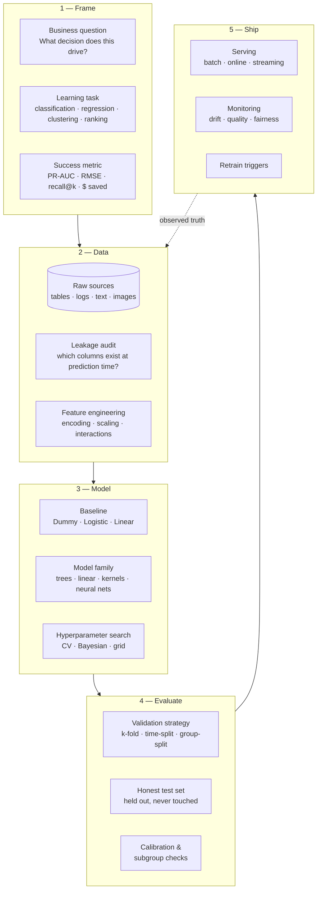
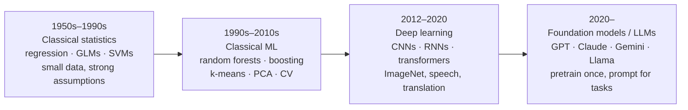
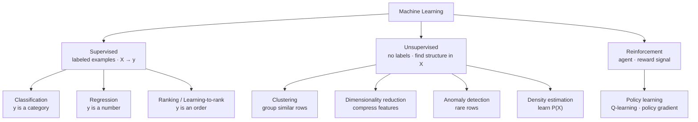
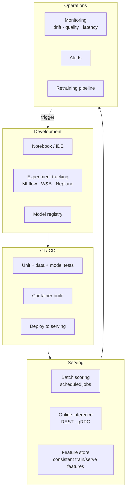
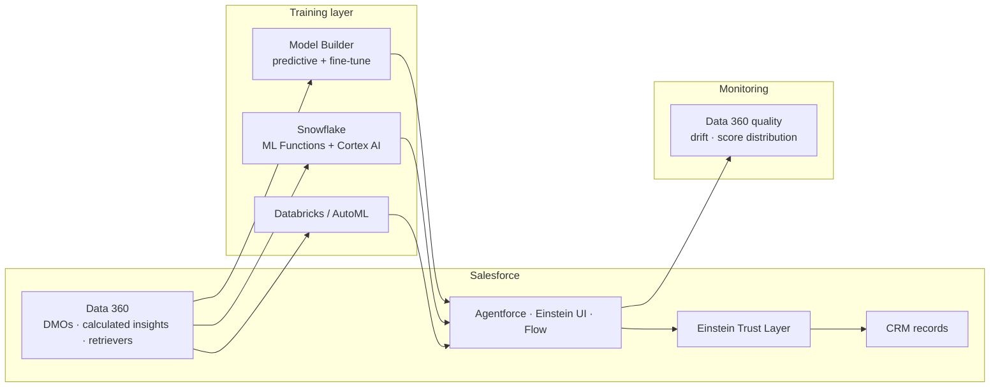

# ML 101 — concepts, evolution, and choosing the right model for the job

A quick-reference for the concepts that explain most day-to-day work with machine learning, plus the map of model families and the practitioner questions that decide which one fits. Generic — swap in your own data, target, and success metric.

> **Audience:** written for technical architects, engineering leads, and enterprise data practitioners — not as a math-first ML textbook. The emphasis is on framing, tradeoffs, and delivery, with just enough math to make the tradeoffs legible. If you want the derivations, "Elements of Statistical Learning" (Hastie, Tibshirani, Friedman) and "Pattern Recognition and Machine Learning" (Bishop) are the classics.

> **Naming note:** "AI," "ML," "statistical learning," and "predictive analytics" get used interchangeably in marketing. This guide uses **machine learning (ML)** to mean *any system that learns a function from data* — from a linear regression fit in Excel to a billion-parameter transformer. **Statistical learning** is the mathematical parent field; **deep learning** is the neural-network subset; **AI** is the umbrella term that also includes rules and search. Where a distinction matters (regression vs. classification, supervised vs. unsupervised, classical vs. deep), the guide will call it out explicitly.

---

## Contents

- [The mental model in one line](#the-mental-model-in-one-line)
- [What machine learning is](#what-machine-learning-is)
- [How ML evolved — from statistics to deep learning to LLMs](#how-ml-evolved--from-statistics-to-deep-learning-to-llms)
- [ML vs. plain statistical learning](#ml-vs-plain-statistical-learning)
- [Enterprise value proposition](#enterprise-value-proposition)
- [Core concepts](#core-concepts)
- [Common ML project types by business question](#common-ml-project-types-by-business-question)
- [ML vs. LLM vs. Rules — which tool for which job](#ml-vs-llm-vs-rules--which-tool-for-which-job)
- [Model families — a practitioner's map](#model-families--a-practitioners-map)
- [When to choose what — the practitioner's decision guide](#when-to-choose-what--the-practitioners-decision-guide)
- [The ML lifecycle in practice](#the-ml-lifecycle-in-practice)
- [Feature engineering — where domain knowledge lives](#feature-engineering--where-domain-knowledge-lives)
- [AutoML and no-code ML — where they help, where they trap you](#automl-and-no-code-ml--where-they-help-where-they-trap-you)
- [MLOps — the boring stuff that decides whether ML survives contact with production](#mlops--the-boring-stuff-that-decides-whether-ml-survives-contact-with-production)
- [ML and Salesforce mental model](#ml-and-salesforce-mental-model)
- [Gotchas worth knowing early](#gotchas-worth-knowing-early)
- [Training a first model from Python (scikit-learn)](#training-a-first-model-from-python-scikit-learn)
- [Time-series forecasting starter (Python)](#time-series-forecasting-starter-python)
- [What this 101 intentionally does not cover deeply](#what-this-101-intentionally-does-not-cover-deeply)
- [Companion tools referenced in this guide](#companion-tools-referenced-in-this-guide)

---

## The mental model in one line

**ML is the discipline of fitting a function from examples, then trusting it on new inputs — and the hard part is almost never "which algorithm," it is *framing the problem, choosing the metric, and avoiding leakage before you train anything*.** Everything else — model families, feature engineering, hyperparameter tuning, MLOps, monitoring — is either shaping the training data, shaping the objective, or evaluating the fitted function honestly.



The diagram is the whole pitch: model fitting is one box in a five-box lifecycle, and the boxes on either side of it are where projects actually succeed or fail. A team that skips the framing box and jumps to model selection has already lost.

---

## What machine learning is

**Machine learning is the study and practice of algorithms that improve at a task by seeing examples of it.** A learning algorithm takes a labeled or unlabeled dataset and produces a *fitted model* — a function that maps inputs to outputs. Once fitted, that function runs on new inputs to make predictions.

A simple way to explain it to enterprise teams:

> Machine learning turns historical data plus a well-framed question into a function you can call on new data. The value is not the model file — it is the automation of a decision that used to require a human to look at each case.

Three shifts that separate ML from traditional software engineering:

* **Data-defined behavior.** In classical code, a developer writes the rules. In ML, the rules are inferred from examples. Same code path, different training data → different behavior. That makes datasets first-class artifacts to version, review, and govern.
* **Probabilistic outputs.** Most ML systems output a *score* (probability, distance, ranking), not a hard yes/no. Business logic has to turn a score into an action — usually via a threshold that trades precision for recall.
* **Distribution assumptions.** The model works only on inputs that look like its training data. When reality drifts (a new product line, a new fraud pattern, a new customer segment), the model degrades silently. Monitoring is not optional.

---

## How ML evolved — from statistics to deep learning to LLMs

Every era added a technique without replacing the last one. In production today you will see all four side by side.



- **Classical statistics** (1900s onward, but the ML era starts ~1950s with perceptrons and 1960s–1990s with linear/logistic regression, generalized linear models, support vector machines, discriminant analysis). Emphasis: interpretable coefficients, hypothesis tests, confidence intervals. Assumes a lot about the data (linearity, independence, distribution). Still the right tool for small samples, causal questions, and any setting where you must *explain* the model to a regulator.
- **Classical ML** (1990s–2010s: decision trees, random forests, gradient boosting, k-means, PCA, cross-validation). Emphasis: predictive accuracy over interpretability. Fewer assumptions, more capacity, tabular data still dominates. **Gradient-boosted trees (XGBoost, LightGBM, CatBoost) remain the strongest practical default for most structured tabular problems** — deep tabular models are worth testing only when data volume, feature type, and tuning budget justify the extra complexity.
- **Deep learning** (2012 ImageNet moment onward: convolutional nets, recurrent nets, transformers). Emphasis: representation learning — the model learns its own features from raw pixels, audio, or text. Enabled by GPUs and massive labeled datasets. Dominates images, audio, and text; overkill and often worse than trees on flat tabular data.
- **Foundation models / LLMs** (2020 onward: GPT-3, Claude, Gemini, Llama). Emphasis: pretrain on the internet once, then adapt to specific tasks by *prompting* rather than by training a new classifier. Absorbed most NLP tasks — extraction, classification, summarization, translation — that used to require bespoke ML. But **LLMs did not replace classical ML for numeric prediction on structured data**; they are a different tool for a different problem.

The important thing for architects: **the eras compose, they don't cancel out**. A modern production stack might have a logistic regression scoring credit risk (statistical, regulated), a LightGBM forecasting demand (classical ML), a CNN reading receipts (deep learning), and an LLM writing customer summaries (foundation model) — all under the same MLOps roof.

---

## ML vs. plain statistical learning

They share the math and much of the vocabulary. What differs is emphasis, not lineage.

| Aspect | Classical statistics | Machine learning |
|---|---|---|
| Primary goal | **Inference** — estimate parameters, test hypotheses, quantify uncertainty about a population | **Prediction** — minimize error on new data, whatever the parameters end up being |
| Model choice | Small, interpretable, assumption-checked (linear/logistic regression, GLM, mixed models) | Whichever fits best, even if opaque (random forest, gradient boosting, deep nets) |
| Data volume | Tens to thousands of well-designed observations | Thousands to billions of examples |
| Assumptions | Explicit: linearity, independence, normality of residuals, homoscedasticity | Weaker: mostly "future data looks like training data" (i.i.d.) |
| Evaluation | p-values, confidence intervals, likelihood ratios, information criteria | Held-out test error, cross-validation, ROC/PR curves, business KPIs |
| Feature engineering | Careful, theory-driven, one term at a time | Aggressive, automated, thousands of features acceptable |
| Overfitting concern | Managed via degrees of freedom, regularization, model comparison tests | Managed via cross-validation, regularization, early stopping, ensembling |
| Interpretability | Coefficients *are* the story | Post-hoc via SHAP, permutation importance, partial dependence plots |
| Typical output | "The effect of X on Y is 0.42 ± 0.05, p < 0.01" | "The model predicts Y=1 with probability 0.87" |

Same math, different question. A statistician asks *"is this effect real?"* An ML engineer asks *"does this model generalize?"* On healthcare, credit, and hiring problems you often want *both* — a regulated logistic regression for the decision and a stronger tree ensemble kept in reserve for what-if analysis.

**Practical takeaway:** if the audience is a regulator, an auditor, or a scientist, lean statistical (fewer parameters, explicit assumptions, uncertainty on every estimate). If the audience is a product KPI, lean ML (whatever generalizes best on held-out data).

---

## Enterprise value proposition

ML is strongest when a business has a **repeated decision made against noisy structured data**, plenty of historical outcomes to learn from, and a clear success metric.

Common enterprise benefits:

- **Automation of judgment work.** Credit decisioning, fraud triage, marketing targeting, churn scoring, demand forecasting, quality inspection — decisions humans used to make case-by-case at scale.
- **Personalization at scale.** Recommender systems, next-best-action, price optimization, adaptive content — one model, millions of users.
- **Anomaly and outlier detection.** Fraud, network intrusion, equipment failure, data-quality issues surfaced by learning the normal.
- **Forecasting.** Demand, staffing, cash flow, capacity, supply chain — quantitative planning inputs.
- **Structured extraction from unstructured sources.** OCR, speech-to-text, entity extraction, document classification — now largely handed to LLMs but classical ML still wins on volume/latency.
- **In-platform ML.** Snowflake Cortex (ML functions + LLMs), Salesforce Model Builder (Data 360's AI Models surface, formerly Einstein Studio; **Data 360** is the current name for what used to be **Data Cloud**), Databricks (AutoML + notebooks), and hyperscaler AutoML bring ML inside existing governance perimeters — often the right first move for enterprise teams.

ML is not free. The costs teams underestimate: labeling and label quality, evaluation infrastructure, drift monitoring, retraining pipelines, model risk review, and the meta-problem of *knowing when a model is silently wrong*. A trained model file is 5% of the total system.

---

## Core concepts

### The three learning paradigms



- **Supervised learning** — you have inputs `X` and known outputs `y`. Fit `f(X) ≈ y`. The 90% case in enterprise ML.
- **Unsupervised learning** — you have only `X`. Find structure: clusters, low-dim representations, anomalies. Useful for segmentation, exploration, and preprocessing.
- **Reinforcement learning** — an agent takes actions in an environment and receives rewards. Robotics, game playing, some ad bidding, recommender re-ranking. Rarely the first tool an enterprise reaches for; usually the last.
- **Semi-supervised / self-supervised** — a small labeled set plus lots of unlabeled data. Self-supervised is what pretrains LLMs and vision transformers.

### The vocabulary you cannot skip

**Feature (predictor, covariate)** — one input column. `age`, `zip_code`, `days_since_last_purchase`. In deep learning the model learns its own features from raw pixels or tokens.

**Target (label, response, dependent variable)** — what you are predicting. `will_churn`, `sale_price`, `fraud_flag`. The single most important choice in the whole project; get it wrong and nothing else matters.

**Training / validation / test sets** — the three-way split. Train fits the model; validation tunes hyperparameters and picks the best model; test is looked at *once* at the very end to report honest performance. Peeking at the test set is the most common way teams fool themselves.

**Overfitting / underfitting** — overfitting is memorizing the training set at the cost of generalization (great on train, bad on test). Underfitting is a model too weak to capture the pattern (bad on both). The whole tuning game is finding the sweet spot.

**Bias–variance tradeoff** — high-bias models miss the pattern (linear on nonlinear data); high-variance models chase noise (deep trees, unregularized nets). Regularization, ensembling, and more data all reduce variance.

**Cross-validation (CV)** — the honest way to estimate held-out error when data is limited. Split into `k` folds, train on `k-1`, evaluate on the leftover, rotate, average. Use **time-based splits**, not random shuffles, whenever the target depends on time.

**Regularization** — penalizing complexity to prevent overfitting. `L1` (lasso, drives some coefficients to zero → feature selection), `L2` (ridge, shrinks all coefficients), dropout for neural nets, early stopping for boosting.

**Hyperparameters** — knobs you set *before* training, distinct from parameters the model learns. Tree depth, learning rate, number of estimators, regularization strength. Tuned via grid search, random search, or Bayesian optimization on the validation set.

**Loss function (objective)** — the number the optimizer is trying to minimize. `MSE` for regression, `cross-entropy` for classification, `hinge` for SVMs, custom losses for asymmetric cost. **This is where you encode "what does wrong mean"**, and it is often more important than the model family.

**Metric** — how you *score* the model (distinct from loss, though sometimes they coincide). Accuracy, precision, recall, F1, PR-AUC, ROC-AUC for classification; RMSE, MAE, R² for regression; MAP, nDCG for ranking. **Almost every ML disaster in production traces to a wrong choice here.**

**Class imbalance** — one outcome is much rarer than the other (fraud 0.2%, churn 5%). Breaks accuracy as a metric and biases models toward the majority. Handle via `class_weight`, resampling, or a threshold optimized on validation.

**Data leakage** — a feature contains information you would not have at prediction time. The classic tell: `total_amount` when you're predicting `tip_amount` on a taxi ride. Leakage makes training scores look brilliant and production scores useless. The single most valuable question in ML: *"is this column actually known at the moment we make the prediction?"*

**Calibration** — do predicted probabilities *mean* what they say? If the model calls 100 cases "70%," about 70 of them should actually be positive. Uncalibrated scores rank correctly but can't be interpreted as probabilities. Fix with Platt scaling or isotonic regression on validation data.

**Feature importance / SHAP** — post-hoc explanations of *which features drove a prediction*. SHAP values are the current standard; permutation importance is a cheaper approximation. Use for debugging and stakeholder trust, not as ground truth about causation.

**Drift** — training data assumed distribution `P₀(X, y)`, production sees `P₁(X, y)`. Covariate drift is `P(X)` changes; concept drift is `P(y | X)` changes. Both silently degrade models; only monitoring catches them.

---

## Common ML project types by business question

Most enterprise ML projects fall into a handful of patterns. Recognising the pattern early tells you the learning task, the metric family, and — often — which tier of the stack should own it.

| Business question | ML task | Typical output | First metric to reach for |
|---|---|---|---|
| "Who will churn / default / convert in the next N days?" | Binary classification | Score per customer | PR-AUC (imbalanced), recall @ fixed precision |
| "How much demand next week / next quarter?" | Regression / forecasting | Point forecast + interval | MAE / RMSE, MASE vs. naive |
| "What's the right price / expected value?" | Regression | Continuous number | RMSE, business-cost function |
| "Which cases / leads should the team look at first?" | Ranking / learning-to-rank | Ordered list, top-k | Precision@k, MAP, nDCG |
| "Which customers behave similarly?" | Clustering | Group labels | Silhouette + downstream business KPI |
| "Which transactions / events look abnormal?" | Anomaly detection | Anomaly score | Precision @ investigator-capacity, alert cost |
| "What's inside this document / call / image?" | Extraction / classification | Structured fields | Field-level accuracy, entity F1 |
| "Answer this question using our knowledge base." | **Not ML training — retrieval-augmented LLM** | Grounded answer + citations | Faithfulness, retrieval hit-rate |
| "Draft this email / summary / SQL." | **Not ML training — LLM prompting** | Text | Human eval, LLM-as-judge, downstream conversion |
| "If we intervene, will the outcome change?" | **Not predictive ML — causal / uplift** | Effect estimate | Uplift AUC, ATE with confidence interval |
| "Recommend items this user is likely to engage with." | Recommender (implicit-feedback ranking) | Ordered item list | Recall@k, nDCG@k, revenue lift |

Two things worth internalising from this table:

- **The last three rows are traps** if you treat them as classical predictive ML. Grounded question-answering wants RAG, not a classifier. Text drafting wants an LLM, not a fine-tuned model in most cases. Causal questions ("what happens if we send this coupon?") want causal-inference methods (uplift trees, doubly-robust estimators), because a predictive model will happily learn correlations that don't reflect the effect of an intervention.
- **The metric column is where projects live or die**, not the algorithm column. A churn model optimised for accuracy on a 5%-positive class is broken before it's built, regardless of whether it's logistic regression or XGBoost.

---

## ML vs. LLM vs. Rules — which tool for which job

Not every "AI" problem is an ML problem, and not every ML problem is best solved by training a model.

| Situation | Best tool | Why |
|---|---|---|
| The logic is explicit, stable, and auditable ("if state = CA and product = auto, apply rate X") | **Business rules / decision tables** | No training data needed; fully explainable; fastest to change; auditable |
| You have thousands+ labelled historical outcomes and want to predict a number or class from structured features | **Classical ML** (logistic, boosting, forests) | Trainable on tabular data; well-understood evaluation and calibration |
| The task is over language: summarise, classify, extract, translate, draft, answer with nuance | **LLM** (prompt, structured output) | Zero or few labels needed; task specified in the prompt; ships in a sprint |
| The task is answering questions from your knowledge base | **RAG** (retrieval + LLM) | The issue is grounding, not prediction — retrieve the right passage, then generate |
| The task is multi-step reasoning with tool calls | **Agent** (LLM + tools in a loop) | Model chooses which tool to call and when; loop until done |
| The task needs prediction *and* explanation for a regulator | **Classical ML with interpretable model** (monotonic GBM, GAM, logistic) | LLMs are unauditable; rules can be under-fit; interpretable ML is the middle ground |
| You have thousands of similar cases and want an outcome forecast per case | **Classical ML** | LLMs are wrong tool for numeric prediction on tabular data |
| You have millions of cases per day and pennies of latency budget | **Classical ML** | LLM inference is 100–10,000× slower per call |

**Rule of thumb:** if the problem statement mentions numbers, probabilities, or ranking on structured data, start with classical ML. If it mentions language, meaning, or unstructured content, start with an LLM. If it mentions "why did this happen" or "what if we did X," neither is right — reach for causal inference or a controlled experiment.

The three tools also compose: a classical ML score can be one *feature* fed into an LLM prompt ("here's the customer's churn score, draft a retention email"), and an LLM can be a preprocessing step that turns unstructured text into features for a classical model.

---

## Model families — a practitioner's map

The families you actually pick between. Every row includes when to reach for it, and when not to.

### Tabular data (the enterprise 80% case)

| Family | Use when | Avoid when |
|---|---|---|
| **Logistic / Linear regression** | Small n, need interpretability, regulated setting, want confidence intervals | Nonlinear interactions dominate |
| **Regularized linear (Ridge, Lasso, ElasticNet)** | Many correlated features, want automatic feature selection | Nonlinear relationships |
| **Random Forest** | Solid default, low tuning, mixed data types, moderate n | Extreme imbalance, streaming inference on giant models |
| **Gradient Boosting (XGBoost / LightGBM / CatBoost)** | Strongest practical default on structured tabular problems. High-cardinality categoricals (CatBoost native), imbalance, ranking | Very small n (<500), you need coefficients not scores |
| **Support Vector Machines (SVM)** | Small n, high-dimensional (e.g. TF-IDF text), clear margin | Big data — training scales poorly |
| **k-Nearest Neighbors (kNN)** | Very small n, want a quick sanity check | Big data, high-dimensional features |
| **Naive Bayes** | Text classification baseline, streaming with per-feature updates | Correlated features (violates the "naive" independence) |
| **Deep learning (MLPs, TabNet, FT-Transformer)** | Very large n *and* trees plateau *and* you can afford the tuning | Almost always: try trees first |

**Rule of thumb:** for a tabular problem, start with `DummyClassifier`/`DummyRegressor` → `LogisticRegression`/`LinearRegression` → `RandomForest` → `LightGBM` or `XGBoost` (or `CatBoost` if you have high-card categoricals). Report all four. If the boosting model doesn't materially beat the baseline, the problem is in the data or the framing.

### Text

| Family | Use when |
|---|---|
| **TF-IDF + Logistic / Naive Bayes / linear SVM** | Baseline. Fast, cheap, hard to beat on small labeled text sets |
| **Word embeddings + linear model** (Word2Vec, GloVe, FastText) | Some transfer from unlabeled corpora; largely superseded by transformers |
| **Fine-tuned transformer** (BERT, RoBERTa, DeBERTa) | You have labels and the baseline plateaus; latency budget allows GPU inference |
| **LLM (prompting)** | Zero or few labeled examples; task is nuanced; latency and cost acceptable |
| **LLM (fine-tune)** | You have thousands of labels and consistent format matters (extraction, structured output) |

The 2020s shift: for **many text tasks the right first tool is an LLM prompt, not a trained model**. Reach for a classical text classifier when volume × latency × cost math forces it, or when the labels are ample and specific.

### Images

| Family | Use when |
|---|---|
| **Classical (HOG, SIFT + SVM)** | Only for teaching or embedded devices without accelerators |
| **CNN from scratch** | Historical baseline; rarely justified today |
| **Transfer learning from a pretrained CNN** (ResNet, EfficientNet) | Default modern approach — fine-tune the head |
| **Vision Transformer (ViT, DINOv2, SAM)** | Larger datasets, complex scenes, need strong features from a frozen backbone |
| **Frontier multimodal LLM** (e.g. GPT-5.x, Claude Opus / Sonnet, Gemini 2.5/3.x) | Zero-shot classification, VQA, document understanding without training a model — versions move fast, pin exact IDs in production |

### Time series and forecasting

| Family | Use when |
|---|---|
| **Naive / seasonal-naive baseline** | Always run this first — many "sophisticated" models don't beat it |
| **ARIMA / SARIMAX** | Univariate, moderate seasonality, need confidence intervals |
| **Prophet** | Business series with holidays and multiple seasonalities, non-experts need to reason about it |
| **Gradient boosting on lag features** | Multivariate, feature-rich, plenty of history |
| **Deep learning (N-BEATS, Temporal Fusion Transformer, TimesNet)** | Very long history, many related series that share structure; the model is trained *across* those series and then applied to them (or to new ones with fine-tuning) |
| **Foundation forecasting models** (TimesFM, Chronos) | Emerging: pretrained on billions of series, so **zero-/few-shot** on a new series without training |

### Unsupervised

| Family | Use when |
|---|---|
| **k-Means** | Round, roughly equal-sized clusters; you know approximately how many |
| **DBSCAN / HDBSCAN** | Irregular shapes, unknown cluster count, robust to noise |
| **Gaussian Mixture Models** | Soft cluster membership; overlapping groups |
| **Hierarchical / Agglomerative** | Small n, want a dendrogram; nested structure |
| **PCA** | Linear compression; preprocessing before another model |
| **t-SNE** | 2D/3D visualization only — non-parametric, doesn't preserve global structure, don't use as features |
| **UMAP** | Primarily visualization; can serve as a preprocessing/dim-reduction step for a downstream model when the pipeline is validated end-to-end (unlike t-SNE, it's parametric and can transform new points) |
| **Isolation Forest / One-Class SVM / Local Outlier Factor** | Anomaly detection when anomalies are unlabeled |

### Recommenders

| Family | Use when |
|---|---|
| **Popularity / recency baseline** | Cold start, no personalization signal yet |
| **Collaborative filtering (matrix factorization, ALS)** | You have user × item interactions; classic Netflix Prize approach |
| **Content-based** | New items appear constantly (cold start on the item side) |
| **Two-tower neural nets** | Large-scale personalized retrieval — Google, YouTube, Meta pattern |
| **LLM-as-reranker** | Small candidate set, nuanced signals in text |

---

## When to choose what — the practitioner's decision guide

Skip the algorithm question until you've answered these six. This is exactly the flow ML Compass (the companion tool) enforces.

### 1. Is it supervised, unsupervised, or something else?

- **Do you have labeled examples of the outcome?** Yes → supervised. No → unsupervised (clustering, anomaly, dim reduction) or reframe as "would a human label 500 examples?"
- **Are actions/rewards involved rather than static outcomes?** → reinforcement learning territory.
- **Is the "outcome" actually free text that a person could summarize?** → probably an LLM prompt, not a training run.

### 2. If supervised, is it classification, regression, or ordinal?

- Numeric target with many distinct values → **regression**.
- Numeric target with ≤ ~15 distinct values (a 1–5 rating, a severity score) → **framing-ambiguous**. Ordinal regression (treats order as real) is often best; pure classification loses order; pure regression treats "3" and "5" as equidistant from "4," which may be wrong.
- Categorical target, 2 classes → **binary classification**.
- Categorical target, >2 classes → **multiclass**.
- Multiple non-exclusive labels per row → **multilabel** (a separate classifier per label, or a joint model).

### 3. What is the honest success metric?

Nine times out of ten this is *not* accuracy.

| Situation | Metric to prefer |
|---|---|
| Balanced classes, symmetric error cost | Accuracy (rare enterprise case) |
| Imbalanced classes (fraud, churn, rare disease) | **PR-AUC** or recall at fixed precision |
| False positives and false negatives cost differently | Weighted F-β, or optimize expected cost directly |
| You will *rank* (top-k emails to send, top-k cases to review) | **Precision@k**, MAP, nDCG |
| Regression | RMSE (penalizes big errors), MAE (robust to outliers), MAPE (relative errors, but breaks near zero) |
| Time-series forecasting | RMSE + MASE (compares to naive baseline) |
| You need a *probability*, not a rank | Log loss + calibration checks (Brier score, reliability diagram) |

**Rule:** pick the metric by asking *"what business action does the score drive, and what does the wrong action cost?"* Then optimize *that*.

### 4. Is the data time-dependent?

If yes — the target correlates with time, or new data has a different distribution than old data — you must:

- **Split by time**, not randomly. Train on the past, validate on the middle, test on the most recent slice.
- Beware features that leak the future (e.g. moving averages computed across the whole dataset).
- Consider a rolling / expanding-window CV instead of k-fold.

Random shuffling on time-series data is one of the top three ways ML projects silently lie about their performance.

### 5. What columns will you actually have at prediction time?

The single most important leakage question. For every candidate feature, ask: *"at the moment we make the prediction, is this value already known?"* Anything that's populated only *after* the outcome — `cancellation_reason`, `total_paid`, `settlement_date`, `duration_of_call` — is a leak, no matter how predictive it looks.

Automated regexes (like ML Compass's `LEAKY_RE`) can flag obvious tells (`total`, `final`, `outcome`, `paid`, `settle`), but they will false-positive (`final_score` in a game) and miss leaks under bland names. The only real defense is going column by column with a domain expert.

### 6. Is the setting regulated, high-stakes, or subgroup-sensitive?

Healthcare, credit, hiring, insurance, criminal justice, and increasingly EU-regulated products need:

- **Interpretability** — keep a simpler model (logistic regression, monotonic GBM) in the comparison; be able to explain individual predictions.
- **Calibration** — a "70% risk" must mean 70%, not just rank high.
- **Subgroup evaluation** — the model's error rate across age, sex, region, ethnicity — not just overall.
- **Documentation** — model cards, datasheets, and versioned lineage of training data.
- **Human-in-the-loop** — the model recommends, a person decides. Especially for irreversible actions.

The right first-choice model in a regulated setting is almost always a *simpler* one you can defend to a regulator, not the strongest one on the leaderboard.

---

## The ML lifecycle in practice

The five-box diagram at the top of the guide, unrolled with what a team actually spends time on.

### 1 — Frame

- Turn the business question into a learning task. "Reduce churn" → "predict who will churn in the next 90 days so retention can prioritize outreach."
- Choose the metric. Get the stakeholder to agree in writing.
- Sketch how the model output will be used. Threshold and action? Ranked list? Displayed score?
- **Time to spend:** 20% of the project. Teams that skimp here rebuild in month three.

### 2 — Data

- Pull the data, join it, verify volumes and joins.
- Profile every column: type, cardinality, missingness, obvious anomalies.
- **Leakage audit.** The single most important step. Walk column by column: is this known at prediction time?
- Feature engineering: encodings (one-hot, target, frequency), scaling, ratios, date parts, aggregations, text vectorization.
- Handle missing data explicitly — imputation is a modeling decision, not a preprocessing detail.
- **Time to spend:** 40% of the project. This is the largest bucket by far and always underestimated.

### 3 — Model

- Fit a **baseline** — DummyClassifier / DummyRegressor / seasonal-naive / TF-IDF+Logistic. Report its number honestly.
- Fit a **strong default** — LightGBM/XGBoost for tabular, transfer-learned CNN for images, LLM prompt for many text tasks.
- Tune hyperparameters on the validation set only. Cross-validate. Don't peek at the test set.
- **Time to spend:** 15% of the project. Model fitting is *not* where most of the time goes — a shocking fact for teams new to ML.

### 4 — Evaluate

- Held-out test set → report the metric.
- Confusion matrix, PR curve, calibration plot, subgroup breakdown.
- Error analysis: sample the worst mispredictions and look at them. Every ML system's next improvement idea lives here.
- Compare against the baseline. If the strong model doesn't beat baseline by a meaningful margin, either the data or the framing is the problem.
- **Time to spend:** 15% of the project.

### 5 — Ship

- Serving pattern: batch (nightly scores in a table), online (a REST endpoint), or streaming (Kafka/Kinesis feature service).
- Monitoring: input drift, prediction drift, downstream quality (once labels arrive).
- Retraining triggers: on a schedule, on drift alert, or on drop in downstream KPI.
- Governance: model card, lineage, approval, rollback plan.
- **Time to spend:** 10% of the project — but 100% of the *maintenance* burden thereafter.

---

## Feature engineering — where domain knowledge lives

Model families are commoditized. Features are where teams still add value.

**Numeric features**
- Ratios and differences that make domain sense (`price / income`, `days_since_last_click`).
- Log-transforms for skewed distributions.
- Binning only when the model genuinely can't handle continuous features (rare).
- Scaling for distance-based models (kNN, SVM, k-Means, neural nets); trees don't need it.

**Categorical features**
- One-hot for low-cardinality (< 30 levels).
- Target encoding (mean of target per category) for high-cardinality — but *inside cross-validation folds* to avoid leakage.
- Frequency encoding (how often each level appears) as a robust default.
- Native handling by CatBoost / LightGBM.

**Datetime features**
- Calendar parts: hour, day-of-week, month, is_weekend.
- Cyclical encoding: `sin(2π · hour / 24)`, `cos(...)` — so 23:00 and 01:00 are "close."
- Recency and tenure: days since a reference event.
- Holidays, campaigns, custom business calendars.

**Text features**
- TF-IDF (n-grams, character or word).
- Length, keyword flags, punctuation ratios.
- Pretrained embeddings (all-MiniLM, E5, BGE) as feature vectors for downstream models.
- Direct fine-tune or LLM prompt when the labels or nuance justify it.

**Interaction features**
- Products, ratios, and grouped aggregates that encode business logic.
- Trees discover many interactions themselves; linear models need them spelled out.

**Aggregate / windowed features**
- Rolling means, counts, and standard deviations over prior time windows.
- Group-level aggregates (`avg_purchase_by_customer_segment`).
- Beware of time leakage — always compute aggregates over data available *before* the prediction moment.

The line between feature engineering and modeling has blurred in deep learning (the model learns features from raw pixels) but on tabular data it remains where most of the accuracy lift comes from.

---

## AutoML and no-code ML — where they help, where they trap you

AutoML products (H2O, DataRobot, Google Vertex AutoML, Azure AutoML, Databricks AutoML) and no-code trainers (**Salesforce Model Builder — in Data 360's *AI Models* surface, formerly Einstein Studio**; **Snowflake Cortex ML functions**) do a lot of the tedious work:

- Try many model families with sensible hyperparameters.
- Handle basic missing values and encoding.
- Produce a leaderboard and a fitted best model.
- Deploy behind a REST endpoint or SQL function.

What they typically do *not* do (or don't do rigorously):

- Force the framing conversation — target definition, metric choice, business action.
- Audit for data leakage. They will happily train on `total_amount` when you're predicting `tip_amount`.
- Pick the honest validation strategy for time-dependent data.
- Interrogate subgroup fairness or calibration.
- Explain individual predictions defensibly to a regulator.
- Monitor for drift after deployment (some do, unevenly).

**The rule of thumb:** AutoML is a great *acceleration* layer once framing, metric, and leakage are settled. It is a dangerous *substitute* for those steps. A team that pushes raw dataset in and pulls "trained model" out has taught the platform to memorize the leaked columns.

This is exactly the gap the **ML Compass** companion tool targets: a pre-flight checklist that runs *before* the AutoML train button. Frame the question, audit leakage, pick the metric, choose the validation strategy — then push the data into Model Builder or Cortex with a defensible bearing.

---

## MLOps — the boring stuff that decides whether ML survives contact with production

A trained model is 5% of a production system. The other 95%:



- **Experiment tracking** — every run, its config, code, data version, and metric. Without it, "we did better last week" is a claim with no proof.
- **Model registry** — the versioned list of trained models, their metadata, and which one is currently in production.
- **Feature store** — computes features consistently for both training and serving. Without one, you get train/serve skew (the model saw different feature values in training than production) which is quietly the second-most-common cause of "the model was great in the notebook, terrible in production."
- **Monitoring** — input drift, prediction drift, downstream quality once labels arrive, latency, cost. Alerts wired to on-call.
- **Retraining** — scheduled or drift-triggered. Include a champion-challenger step so a worse model can't sneak into production.
- **Governance** — model cards, datasheets, lineage, approval workflow, rollback procedure. Non-negotiable for regulated industries.

The good news: the industry has largely converged. MLflow, Kubeflow, SageMaker, Vertex AI, Azure ML, Databricks, and Snowflake all offer variants of the same stack. Pick one, stick with it, don't reinvent.

---

## ML and Salesforce mental model

Salesforce, Data 360, Snowflake, and ML solve different pieces of the enterprise ML story.

- **Salesforce CRM** — operational system where the decision *lands* (a case is routed, a lead is scored, a recommendation is shown to an agent).
- **Salesforce Data 360** — the data + customer-context layer that produces training-ready data across DLOs, DMOs, and unified profiles.
- **Model Builder** (Data 360's AI Models surface, formerly Einstein Studio) — the in-platform trainer: predictive models on Data 360 objects without exporting the data. Also the surface where you fine-tune LLMs.
- **Einstein / Agentforce** — the runtime that consumes trained scores and generative outputs to drive actions.

A practical pattern:

> Data 360 unifies and grounds the data. Model Builder trains a classifier or regressor on Data 360 objects, or fine-tunes an LLM. Einstein/Agentforce surfaces the score or generative output inside the CRM process. Snowflake handles heavier lifting — **ML Functions** for SQL-native predictive training on warehouse data, **Cortex AI** for LLM inference / search / agents — with Data 360 as the binding layer.

### ML concepts → Salesforce equivalents

| ML concept | Closest Salesforce equivalent | Notes |
|---|---|---|
| Training dataset | Data 360 DMO / calculated insight | Governed, permissioned, no export needed. |
| Feature engineering | Data 360 calculated fields, streaming insights | Do the work in the platform to keep it reproducible. |
| Trained classifier / regressor | Model Builder prediction | Deploys as a scored field on the object. |
| Score threshold / action | Flow, Next Best Action, Agentforce action | Threshold decisions belong to business logic. |
| Fine-tuned LLM | Model Builder fine-tune (AI Models) | Stays inside the Salesforce perimeter. |
| Model card / lineage | Einstein Trust Layer + Model Builder metadata | Audit trail for regulator conversations. |
| Drift monitoring | Data 360 quality rules + Model Builder metrics | Alerting is per-implementation. |
| Retraining trigger | Scheduled Flow, MuleSoft, or Data 360 pipeline | No single button; wire it explicitly. |

### Where the ML plugs in



### Snowflake ML Functions vs. Cortex AI — different layers

Two separate Snowflake surfaces get bundled under "AI in Snowflake"; they solve different jobs.

| Surface | What it does | Typical use |
|---|---|---|
| **Snowflake ML Functions** | SQL-invocable predictive ML: **forecasting**, **anomaly detection**, **classification**, **top insights**. `CLASSIFICATION` (and `FORECASTING`) create a **model object** you `PREDICT`/`EVALUATE` against. | Numeric prediction over structured warehouse data — the "train a model in SQL" path. |
| **Cortex AISQL functions** | SQL-invocable **LLM inference** (Claude, Llama, Mistral, Arctic) — `SUMMARIZE`, `CLASSIFY_TEXT`, `EXTRACT_ANSWER`, `TRANSLATE`, `COMPLETE`, plus multimodal. | Language work over text/images/audio; not predictive-ML training. |
| **Cortex Search** | Managed hybrid vector + keyword retrieval. | RAG grounding, not training. |
| **Cortex Analyst** | Natural-language → SQL over semantic models. | Governed self-serve analytics. |
| **Cortex Agents** | Agent loop that plans + calls the above tools. | Multi-step reasoning inside the governance perimeter. |

**Rule of thumb:** if the question is "predict a number or a class," Snowflake ML Functions (or Model Builder / Databricks) is the right tier. If it's "understand or generate text," Cortex AISQL. Both live behind Snowflake RBAC/masking/row-access policies. Full detail in the [Snowflake 101](snowflake101.md) guide.

### In-platform vs. bring-your-own — quick recommendation

- **Default: in-platform Model Builder** for supervised classification/regression on Data 360 objects. Governance is inherited; you don't move data.
- **Snowflake ML Functions** when the training data lives in Snowflake and you want SQL-native predictive ML (forecasting/classification/anomaly) without a separate training pipeline.
- **Snowflake Cortex** for LLM inference, search, and agent workflows over governed data — complementary to, not a replacement for, ML Functions.
- **Databricks / SageMaker / Vertex** when the modeling needs research-grade tooling, custom architectures, or a data science team already living there. Push the fitted model back into Data 360 as an external prediction.
- **BYO fine-tuned LLM** only when regulation forces a specific VPC, or the fine-tune advantage is proven, or pricing math clearly favors it.

---

## Gotchas worth knowing early

1. **A high training score is meaningless.** Only held-out test performance counts. Any model can memorize its training data.
2. **Accuracy is the wrong metric for imbalanced classes.** A "99.8% accurate" fraud model may just be predicting "never fraud." Use PR-AUC, recall-at-precision, or expected cost.
3. **Random splits lie on time-dependent data.** If the future is different from the past, split by time. Full stop.
4. **Leakage is invisible in code review.** It only shows up when you audit *what values a feature could have at prediction time*. Do that audit column by column.
5. **AutoML doesn't remove framing work.** It removes tuning work. Framing is still yours.
6. **Feature engineering beats model choice on tabular problems.** Spending a week on features usually beats spending a week on hyperparameters.
7. **Don't skip boosting on structured tabular data.** Deep tabular models are getting better, but LightGBM/XGBoost/CatBoost still win most tabular benchmarks with far less tuning. Everyone uses neural nets on images, text, and audio; tabular is a different world.
8. **Class weights are not enough for extreme imbalance.** For <1% positive rates, combine class weights, threshold tuning on validation, and PR-AUC as the metric.
9. **Uncalibrated scores rank correctly but can't be interpreted as probabilities.** If a business user is going to look at "72% likely to churn," calibrate.
10. **Correlation is not causation, and ML rarely learns causation.** Do not use a predictive model to answer "what would happen if we intervened?" That's a different discipline (causal inference, uplift modeling).
11. **Drift is the default, not the exception.** Every deployed model degrades. Monitoring is not optional.
12. **The label is often the bug.** Whenever a model looks weirdly good or weirdly bad, suspect the label first: definition ambiguity, timing, or leakage in how the label was constructed.

---

## Training a first model from Python (scikit-learn)

Enough code to have the right muscle memory. Uses scikit-learn, pandas, and (optionally) LightGBM.

```bash
pip install scikit-learn pandas lightgbm shap
```

```python
import pandas as pd
from sklearn.model_selection import train_test_split, cross_val_score, StratifiedKFold
from sklearn.pipeline import Pipeline
from sklearn.compose import ColumnTransformer
from sklearn.preprocessing import OneHotEncoder, StandardScaler
from sklearn.impute import SimpleImputer
from sklearn.linear_model import LogisticRegression
from sklearn.ensemble import RandomForestClassifier
from sklearn.dummy import DummyClassifier
from sklearn.metrics import (
    average_precision_score, roc_auc_score, classification_report,
    precision_recall_curve, brier_score_loss,
)
import lightgbm as lgb

# ---- 1. Load and inspect ----
df = pd.read_csv("customer_churn.csv")
print(df.shape, df["churn"].mean())     # class balance = the metric-choice signal

y = df["churn"]
# drop obvious leaks + IDs — this list comes from a column-by-column audit, not intuition
X = df.drop(columns=["churn", "customer_id", "cancellation_reason",
                     "final_invoice", "contract_end_date"])

num_cols = X.select_dtypes(include="number").columns.tolist()
cat_cols = X.select_dtypes(exclude="number").columns.tolist()

# ---- 2. Split honestly (stratified because churn is imbalanced) ----
X_train, X_test, y_train, y_test = train_test_split(
    X, y, test_size=0.2, stratify=y, random_state=42
)

# ---- 3. Preprocessing pipeline (fit only on training folds → no leakage) ----
prep = ColumnTransformer([
    ("num", Pipeline([("imp", SimpleImputer(strategy="median")),
                      ("scale", StandardScaler())]), num_cols),
    ("cat", Pipeline([("imp", SimpleImputer(strategy="most_frequent")),
                      ("oh", OneHotEncoder(handle_unknown="ignore"))]), cat_cols),
])

# ---- 4. Baseline: DummyClassifier ("always predict majority") ----
dummy = Pipeline([("prep", prep), ("clf", DummyClassifier(strategy="most_frequent"))])
dummy.fit(X_train, y_train)
print("Dummy PR-AUC:", average_precision_score(y_test, dummy.predict_proba(X_test)[:, 1]))

# ---- 5. Baseline: Logistic Regression ----
logit = Pipeline([("prep", prep),
                  ("clf", LogisticRegression(max_iter=1000, class_weight="balanced", random_state=42))])
logit.fit(X_train, y_train)
p = logit.predict_proba(X_test)[:, 1]
print("Logit PR-AUC:", average_precision_score(y_test, p),
      "ROC-AUC:", roc_auc_score(y_test, p))

# ---- 6. Strong default: LightGBM (handles missing values natively) ----
model = lgb.LGBMClassifier(
    n_estimators=500, learning_rate=0.05,
    num_leaves=31, class_weight="balanced",
    random_state=42,
)
# DEMO-ONLY encoding: pd.get_dummies is convenient here but is brittle in production —
# a new category at inference time silently becomes an all-zero row. In production,
# use a fitted OneHotEncoder(handle_unknown="ignore") inside a ColumnTransformer, or
# LightGBM's native `categorical_feature=` argument with a stable category dictionary.
X_train_e = pd.get_dummies(X_train, columns=cat_cols, drop_first=True)
X_test_e = pd.get_dummies(X_test, columns=cat_cols, drop_first=True)
X_test_e = X_test_e.reindex(columns=X_train_e.columns, fill_value=0)

model.fit(X_train_e, y_train)
p = model.predict_proba(X_test_e)[:, 1]
print("LightGBM PR-AUC:", average_precision_score(y_test, p),
      "ROC-AUC:", roc_auc_score(y_test, p),
      "Brier:", brier_score_loss(y_test, p))

# ---- 7. Cross-validated honest estimate ----
cv = StratifiedKFold(n_splits=5, shuffle=True, random_state=42)
scores = cross_val_score(logit, X_train, y_train, cv=cv, scoring="average_precision")
print("Logit 5-fold PR-AUC:", scores.mean().round(3), "±", scores.std().round(3))

# ---- 8. Threshold selection on validation, not test ----
from sklearn.model_selection import cross_val_predict
oof = cross_val_predict(logit, X_train, y_train, cv=cv, method="predict_proba")[:, 1]
prec, rec, thr = precision_recall_curve(y_train, oof)
# example: find the smallest threshold with precision ≥ 0.5
import numpy as np
mask = prec[:-1] >= 0.5
best_thr = thr[mask].min() if mask.any() else 0.5
print(f"Chosen threshold: {best_thr:.3f}")
```

The important habits demonstrated:

- **Baselines first.** Dummy and logistic before boosting.
- **PR-AUC, not accuracy** for imbalanced classes.
- **Explicit leak drop** at the top — this comes from a column-by-column audit.
- **Pipelines** so preprocessing is fit *inside* CV folds, not on the whole set.
- **Cross-validated** score, not just a single train/test split.
- **Threshold chosen on validation**, not on the test set.

For an LLM-adjacent task, the equivalent starting point is a **prompt + structured output**, not `sklearn`. See the LLM 101 guide for that path.

---

## Time-series forecasting starter (Python)

Same discipline, different validation.

```python
import pandas as pd
from sklearn.metrics import mean_absolute_error, mean_squared_error
from sklearn.model_selection import TimeSeriesSplit
import lightgbm as lgb
import numpy as np

df = pd.read_csv("sales.csv", parse_dates=["date"]).sort_values("date")
df["dow"] = df["date"].dt.dayofweek
df["month"] = df["date"].dt.month
df["is_weekend"] = (df["dow"] >= 5).astype(int)
# lag features — compute strictly from the past
for k in [1, 7, 14, 28]:
    df[f"lag_{k}"] = df.groupby("store_id")["sales"].shift(k)
# rolling means — again, only past data
df["roll_7"] = df.groupby("store_id")["sales"].shift(1).rolling(7).mean()
df = df.dropna()

feat = [c for c in df.columns if c not in ("date", "store_id", "sales")]
X, y = df[feat], df["sales"]

# 1. Seasonal-naive baseline: y_hat = value from 7 days ago
naive_pred = df["lag_7"]
print("Naive MAE:", mean_absolute_error(y, naive_pred))

# 2. Time-based CV — NEVER shuffle
tscv = TimeSeriesSplit(n_splits=5)
maes = []
for tr, va in tscv.split(X):
    m = lgb.LGBMRegressor(n_estimators=400, learning_rate=0.05, random_state=42)
    m.fit(X.iloc[tr], y.iloc[tr])
    maes.append(mean_absolute_error(y.iloc[va], m.predict(X.iloc[va])))
print("LightGBM time-CV MAE:", np.mean(maes).round(2))
```

Two things to notice:

- **The naive baseline is competitive.** Half of enterprise forecasting projects don't beat it. Always compute it.
- **`TimeSeriesSplit`, not `KFold`.** Shuffling time destroys the honesty of the estimate.

---

## What this 101 intentionally does not cover deeply

- **Deep learning internals** (backpropagation, optimizers, architectures beyond a few named families). See "Deep Learning" (Goodfellow, Bengio, Courville) or the fast.ai course.
- **Reinforcement learning** — appears rarely in enterprise settings outside recommenders and ad bidding.
- **Causal inference and uplift modeling** — a different discipline from predictive ML; needed when the question is "what happens if we intervene" not "what will happen."
- **LLM / generative AI internals** — covered in the companion **[llm101](llm101.md)** guide.
- **Snowflake Cortex ML function specifics** — covered in the companion **[snowflake101](snowflake101.md)** guide.
- **Fairness/bias mitigation techniques in depth** — a fast-moving space with real tradeoffs; deserves its own guide.
- **AutoML product deep-dives** (DataRobot, H2O Driverless, Google Vertex, Azure). Pick one; the shape is convergent.

---

## Companion tools referenced in this guide

- **[ML Compass](https://github.com/venkatviswa/ml-compass)** — the deterministic pre-flight checklist for ML projects that this guide's decision-flow (framing → leakage → metric → validation → interpretability) is drawn from. Runs entirely in the browser; open source.
- **[Snowflake 101](snowflake101.md)** — the sibling guide covering Snowflake concepts, Cortex, and enterprise positioning.
- **[LLM 101](llm101.md)** — the sibling guide covering LLMs, prompting, agents, and the API surface.

The three guides together cover the enterprise AI/ML stack: **ML 101** for the numeric/predictive layer, **LLM 101** for the generative/reasoning layer, **Snowflake 101** for the governed data and in-platform AI layer. In practice, projects use all three.
