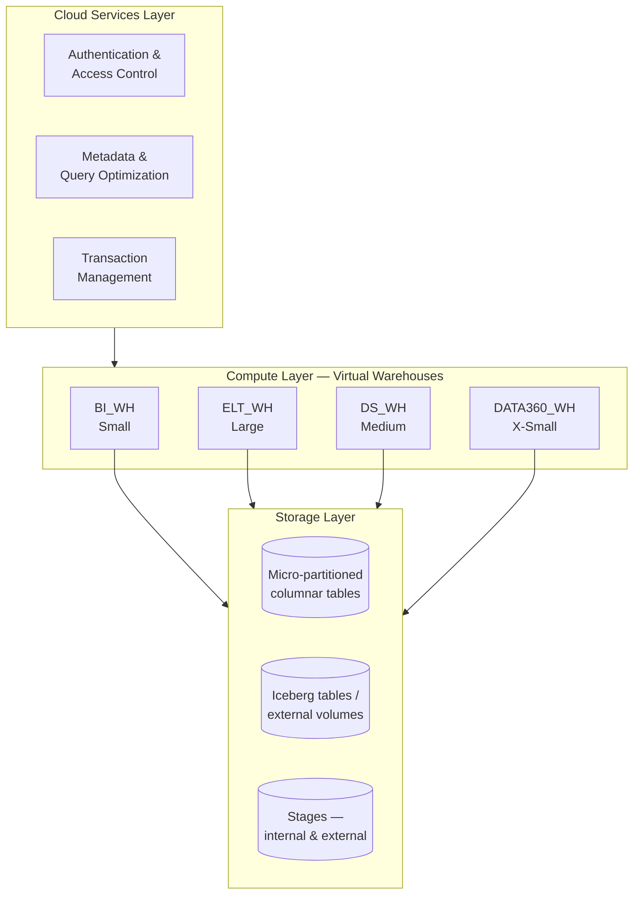
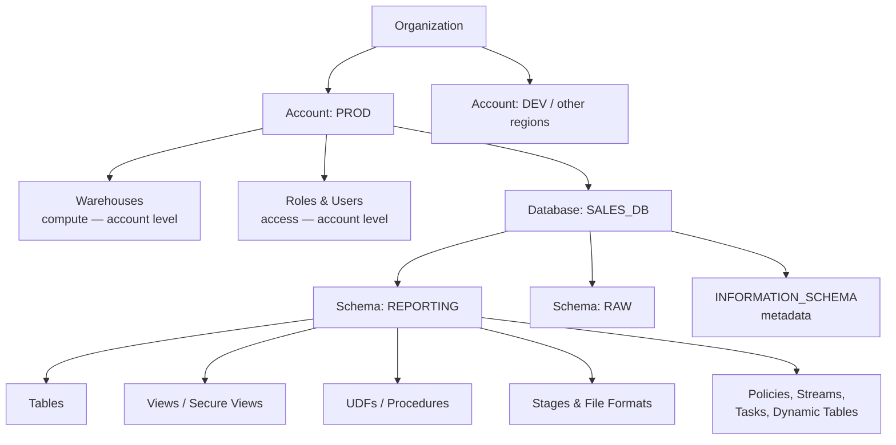
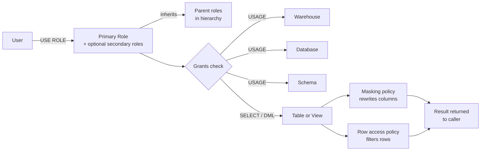
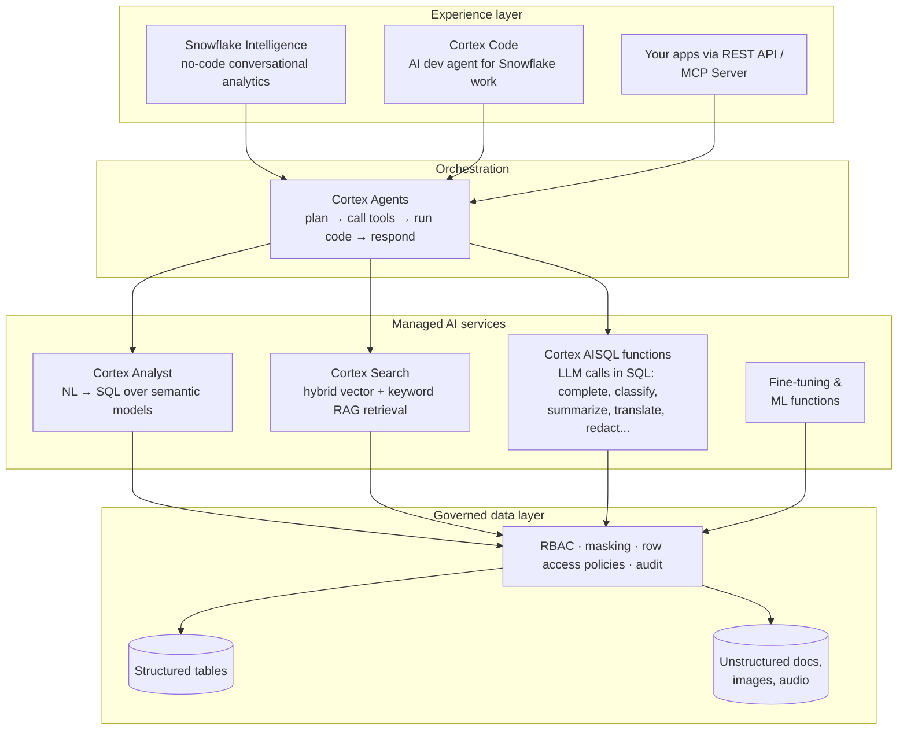
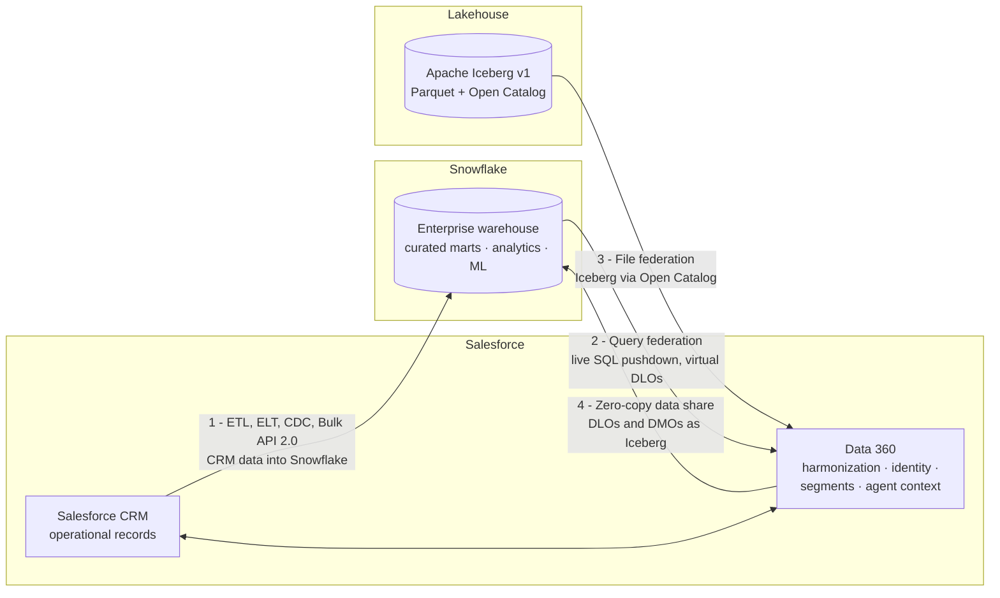
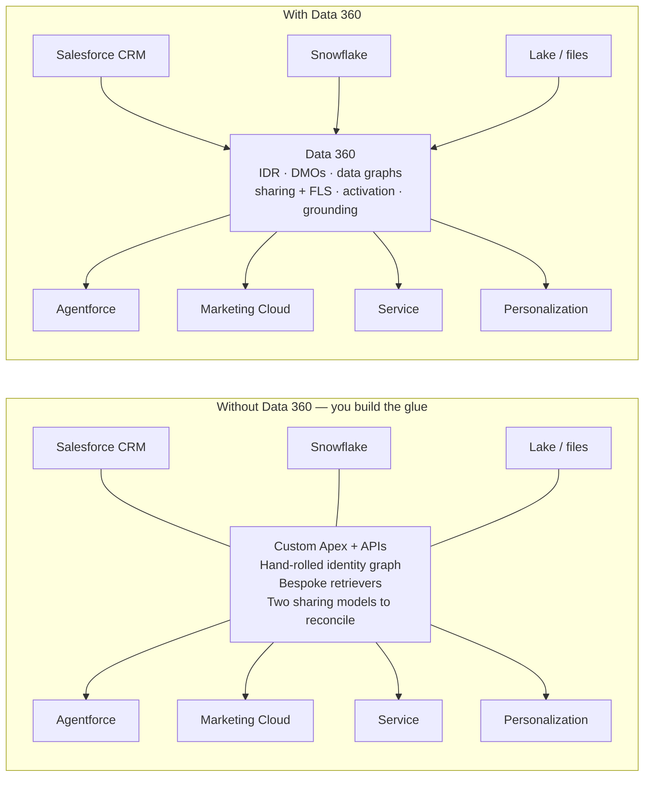
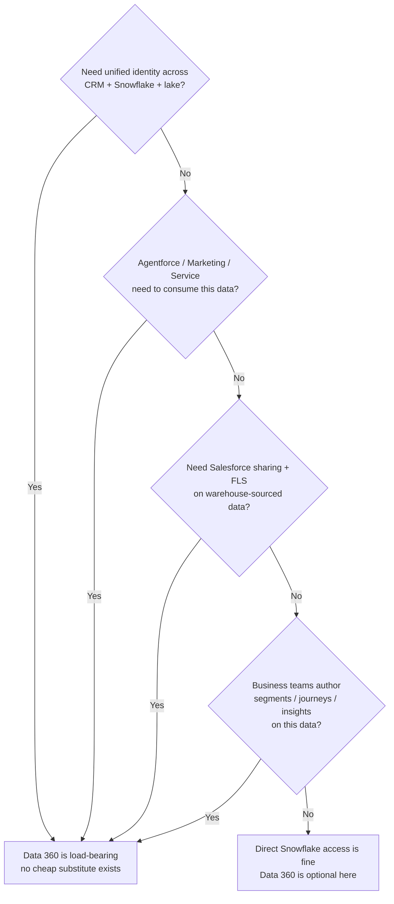

# Snowflake 101 — concepts, enterprise positioning & key SQL cheatsheet

A quick-reference for the concepts that explain most day-to-day Snowflake work, plus the SQL worth keeping at your fingertips. Generic — swap in your own object names.

> **Naming note:** Salesforce documentation is now standardized on **Data 360**. Older names for the same product family — **Data Cloud**, **Customer Data Platform (CDP)**, **C360 Audiences**, and **Genie** — still appear in help articles, Setup UI labels (e.g., "Data Cloud Setup"), permission set names (e.g., "Data Cloud Architect"), and API namespaces (`c360_a_*`, `ssot__`). Where this guide says "Data 360," it refers to the current product; where it quotes a UI label or SQL/permission name that still reads "Data Cloud," that is the on-screen string as of the naming transition, not a separate product.

---

## The mental model in one line

**Snowflake separates storage, compute, and cloud services.** Databases, schemas, and tables represent data/storage. Warehouses are compute engines that run queries and DML. Roles decide who can access which objects. For normal table work, your session usually needs a role, warehouse, database, and schema, although fully qualified object names can replace the current database/schema, and some metadata commands do not require a running warehouse.



The diagram is the whole pitch: many independently sized warehouses hitting the same data, coordinated by a shared services brain. No workload fights another for a fixed box.

---

## What Snowflake is

Snowflake is a cloud data platform used for enterprise analytics, data engineering, data sharing, AI/ML workloads, and application data use cases. At its core, it is a managed data warehouse: you load or connect data, query it with SQL, scale compute up/down independently, and govern access through roles and policies.

The key architectural idea is that Snowflake does not behave like an old single-box database server. Data is stored in cloud storage, optimized into Snowflake-managed columnar micro-partitions for regular Snowflake tables. Compute is provided by one or more virtual warehouses. The cloud services layer coordinates authentication, metadata, optimization, query planning, access control, and transaction management.

A simple way to explain it to enterprise teams:

> Snowflake is the enterprise analytical data layer where large volumes of structured and semi-structured data can be stored, transformed, queried, governed, and shared without every workload fighting for the same fixed database server.

---

## How Snowflake differs from traditional data warehouses

| Area | Traditional warehouse pattern | Snowflake pattern |
|---|---|---|
| Infrastructure | Teams often size and manage fixed database/server capacity. | Snowflake is managed; teams mainly choose warehouse sizes, policies, and data architecture. |
| Storage vs compute | Often tightly coupled: storage and processing capacity scale together. | Storage and compute scale independently. Multiple warehouses can query the same data. |
| Workload isolation | Reporting, ELT, ad hoc analysis, and data science may compete for the same engine. | Separate warehouses can isolate BI, ELT, data science, APIs, and admin workloads. |
| Scaling | Scaling can require hardware planning, downtime, or platform-level changes. | Warehouses can resize, suspend/resume, and multi-cluster warehouses can scale out for concurrency. |
| Cost model | Often license/capacity based, with infrastructure paid whether busy or idle. | Compute is credit-based while warehouses run, with auto-suspend/auto-resume helping control spend. |
| Data sharing | Sharing often means extract files, copy tables, or build pipelines. | Secure sharing and marketplace/listing patterns can expose governed data without copying it. |
| Semi-structured data | JSON/XML often require preprocessing or separate systems. | VARIANT and related functions support semi-structured querying inside SQL. |
| Operations | DBAs often manage storage layout, indexes, partitions, backups, and infrastructure. | Snowflake manages many physical storage concerns; teams still design logical models, governance, and workload/cost controls. |

The important nuance: Snowflake removes a lot of infrastructure work, but it does **not** remove data architecture work. You still need good modeling, naming standards, role design, data quality checks, lineage, cost controls, and lifecycle management.

---

## Enterprise value proposition

Snowflake's enterprise value is strongest when an organization has multiple teams and systems that need shared, governed, scalable data.

Common enterprise benefits:

- **Workload isolation:** Give BI, ELT, data science, and operational reporting separate warehouses so one team's heavy query does not slow everyone else down.
- **Elastic performance:** Resize warehouses for larger workloads; scale out with multi-cluster warehouses for concurrency-heavy use cases.
- **Cost control:** Auto-suspend idle warehouses, use resource monitors, size warehouses to workload patterns, and separate expensive workloads from routine reporting.
- **Governed access:** Use role-based access control, masking policies, row access policies, secure views, tags, and object ownership patterns.
- **Simpler data sharing:** Share governed data across accounts, partners, business units, or clouds without building one-off extract pipelines for every consumer.
- **Data engineering in SQL and Python:** Use SQL, Snowpark, tasks, streams, dynamic tables, external functions, and connectors for pipelines and transformations.
- **AI next to the data:** Cortex brings LLM inference, natural-language analytics, RAG-style retrieval, and managed agents inside the governance perimeter (see the Cortex section below).
- **Open lakehouse support:** Use Apache Iceberg tables when the organization wants open table formats and data stored in external object storage.
- **Cloud integration:** Integrate with AWS, Azure, GCP, BI tools, Python notebooks, dbt, Salesforce/Data 360, and enterprise orchestration platforms.

Snowflake is not automatically cheaper just because it is elastic. It becomes cost-effective when teams actively manage warehouse sizing, auto-suspend, query design, data clustering needs, data retention, and unnecessary copies.

---

## Core concepts

The object hierarchy in one picture:



Note that **warehouses and roles live at the account level**, not inside databases — a warehouse can query any database its role can reach, and a role can span many databases. This trips up people coming from engines where compute and data are fused.

**Organization** — the top-level Snowflake grouping that can contain multiple accounts. Large enterprises often use multiple accounts for production, pre-production, dev/test, different regions, or different business units.

**Account (a.k.a. tenant)** — your organization's isolated Snowflake account, identified by something like `MYORG-MY_ACCOUNT_NAME`. Everything below lives inside an account. The modern account identifier is typically `<org>-<account_name>`; the older account locator form still exists.

**Warehouse** — compute, not storage. A virtual warehouse is a cluster of compute resources that executes SQL, DML, loading/unloading, and Snowpark workloads. Warehouses consume credits while running. Sizes are t-shirt style, X-Small through progressively larger sizes. Bigger can help large or complex queries, but it is not automatically faster for small queries.

Key warehouse behaviors:

- **Auto-suspend** stops the warehouse after an idle period.
- **Auto-resume** starts a suspended warehouse when a statement that needs compute is submitted.
- **Separate warehouses** can isolate workloads against the same underlying data.
- **Multi-cluster warehouses** scale out for concurrency, not just raw single-query speed.
- **Billing has a minimum charge when a warehouse resumes**, so extremely aggressive suspend/resume settings can backfire for workloads with very frequent short gaps.

**Database** — the top-level container for data objects. It holds schemas. Roughly: "a project, application, domain, or shared data product worth of data."

**Schema** — a namespace inside a database. It holds tables, views, functions, stages, policies, file formats, streams, tasks, and other objects. Fully qualified names go `DATABASE.SCHEMA.OBJECT`, for example `SALES_DB.REPORTING.ORDERS`. Every database has an `INFORMATION_SCHEMA` for metadata, and many databases have a `PUBLIC` schema that disciplined teams often avoid for production objects.

**Table** — stores rows. Regular Snowflake tables are stored in Snowflake-managed, optimized columnar format. Snowflake also supports other table types, including Iceberg tables and hybrid tables.

**View** — a saved SQL query that runs when selected. A **secure view** hides its definition from consumers and is commonly used when the view enforces access restrictions or abstraction.

**UDF (user-defined function)** — your own function callable in SQL, written in SQL, Python, Java, JavaScript, or Scala depending on feature support. UDFs are the primary way to extend Snowflake's SQL surface with custom logic — expanded in its own section below.

**Role** — the unit of access control. Privileges are granted to roles, and roles are granted to users or to other roles. You choose a **primary role** with `USE ROLE`; Snowflake can also use **secondary roles** for many non-`CREATE` actions depending on configuration. If you "can't see" an object that exists, first check the current role, available roles, and role hierarchy.

**User** — a login or programmatic identity. `PERSON` users are human users. `SERVICE` users are for applications and integrations that run without human interaction. `LEGACY_SERVICE` exists for older patterns but should generally be avoided for new integrations.

**Grant** — the actual permission: `GRANT <privilege> ON <object> TO ROLE <role>`. Common privileges:

- `USAGE` — may use a warehouse, database, or schema. Needed at every container level.
- `SELECT` — read a table or view.
- `CREATE <object>` — create new objects in a schema.
- `OWNERSHIP` — full control of an object; the owning role controls grants and destructive changes.

How access actually resolves at query time:



Every hop matters: missing `USAGE` on any container level blocks access even when `SELECT` on the table exists, and policies rewrite the result *after* access is granted.

**Masking policy** — column-level governance. A policy attached to a column rewrites the value at query time based on the calling context, such as role or user. The stored value does not change; the result returned to the caller changes.

**Row access policy** — row-level governance. A policy can filter rows visible to a caller based on role, user, entitlement table, or business rule.

**Stage** — a file landing area used for bulk loading/unloading. A stage can be internal to Snowflake or external, pointing at cloud storage such as S3, Azure Blob/ADLS, or GCS. Stages are commonly used with `COPY INTO`.

**File format** — an object that tells Snowflake how to read files in a stage, for example CSV, JSON, Parquet, Avro, ORC, or XML settings.

**Stream** — tracks change data for a table so downstream logic can process inserts, updates, and deletes incrementally.

**Task** — scheduled or dependency-based execution of SQL. Tasks are often used with streams to build incremental pipelines.

**Dynamic table** — a declarative table that Snowflake refreshes based on a target freshness/lag. Think of it as a managed transformation where Snowflake maintains the result set for you.

**Time Travel** — lets you query, clone, or restore data from a previous point in time within the configured retention period.

**Zero-copy clone** — creates a logical copy of a database, schema, or table without immediately duplicating all underlying storage. Useful for development, testing, and safe experimentation.

**Session context** — at any moment your session has a current role, warehouse, database, and schema. Most "it doesn't work" moments are context: wrong role, wrong warehouse, unset database/schema, or case-sensitive quoted identifiers.

---

## Extending Snowflake: UDFs, UDTFs, stored procedures, and Snowpark

Out of the box, Snowflake gives you SQL. The extensibility stack is how you teach the platform *your* logic — and it is a big part of why Snowflake can absorb workloads that used to require exporting data to external compute.

### The extensibility ladder

| Mechanism | Returns | Typical use | Languages |
|---|---|---|---|
| **Scalar UDF** | One value per row | Custom calculations, parsing, standardized business rules (e.g., a canonical member-ID normalizer) | SQL, Python, Java, JavaScript, Scala |
| **UDTF (table function)** | A set of rows per input | Exploding/flattening complex structures, generating rows, per-group computations | SQL, Python, Java, JavaScript, Scala |
| **Stored procedure** | Executes logic with side effects | Orchestration, DDL/DML sequences, admin automation, branching logic | SQL Scripting, Python, Java, JavaScript, Scala |
| **External function** | One value per row, computed *outside* Snowflake | Calling external APIs/services (scoring endpoints, enrichment services) via cloud API gateways | Remote service, any language |
| **Snowpark** | DataFrame results | Python/Java/Scala data engineering and ML pipelines that push computation into Snowflake compute | Python, Java, Scala |

The key distinctions worth internalizing:

- **UDFs compute, procedures act.** A UDF is a pure function used inside a query. A stored procedure runs statements, can modify state, and is invoked with `CALL`.
- **UDFs run inside Snowflake's engine on your warehouse** — the data never leaves the governance perimeter, and the same roles, masking, and row access policies apply. This is why "bring the code to the data" is the default recommendation over "extract the data to the code."
- **External functions are the escape hatch** for logic that must live outside (a licensed scoring API, a service you can't re-implement). They add network latency, an API gateway dependency, and a new security surface — use deliberately.
- **Python UDFs ship with a large Anaconda-curated package repository**, so common data libraries are available without managing your own runtime.

### Why this extends the platform's capability

A UDF turns a one-off transformation into a governed, shareable, reusable SQL object. Instead of five teams each maintaining their own "clean phone number" logic in dbt models, notebooks, and MuleSoft flows, one `COMMON.UTIL.CLEAN_PHONE()` function is granted like any other object, versioned, and consumed uniformly. In regulated industries this matters twice over: the logic is auditable in one place, and it executes where the data already has masking and row policies applied.

### Minimal shapes

```sql
-- SQL scalar UDF
CREATE OR REPLACE FUNCTION AGE_BAND(age NUMBER)
RETURNS STRING
AS $$
  CASE WHEN age < 18 THEN 'MINOR'
       WHEN age < 65 THEN 'ADULT'
       ELSE 'SENIOR' END
$$;

-- Python scalar UDF
CREATE OR REPLACE FUNCTION NORMALIZE_NPI(npi STRING)
RETURNS STRING
LANGUAGE PYTHON
RUNTIME_VERSION = '3.11'
HANDLER = 'normalize'
AS $$
def normalize(npi):
    if npi is None:
        return None
    digits = ''.join(ch for ch in npi if ch.isdigit())
    return digits if len(digits) == 10 else None
$$;

-- Use like any built-in
SELECT provider_id, NORMALIZE_NPI(raw_npi) AS npi
FROM RAW.PROVIDERS;

-- Grant like any object
GRANT USAGE ON FUNCTION NORMALIZE_NPI(STRING) TO ROLE ANALYST_ROLE;
```

Gotcha: UDF grants are on the **signature** — `NORMALIZE_NPI(STRING)` — because Snowflake supports overloading. Granting the name without the argument types fails.

---

## Key SQL

### Where am I? (session context)

```sql
SELECT CURRENT_USER(), CURRENT_ROLE(), CURRENT_WAREHOUSE(),
       CURRENT_DATABASE(), CURRENT_SCHEMA(), CURRENT_ACCOUNT();
```

### Set my context (run these before working)

```sql
USE ROLE      MY_ROLE;
USE WAREHOUSE MY_WH;
USE DATABASE  MY_DB;
USE SCHEMA    MY_SCHEMA;

-- then confirm:
SELECT CURRENT_ROLE(), CURRENT_WAREHOUSE(), CURRENT_DATABASE(), CURRENT_SCHEMA();
```

### What roles are active or available?

```sql
SELECT CURRENT_ROLE();
SELECT CURRENT_SECONDARY_ROLES();
SELECT CURRENT_AVAILABLE_ROLES();

-- Optional: enable all granted secondary roles for non-CREATE actions in this session
USE SECONDARY ROLES ALL;
```

### What exists? (discovery)

```sql
SHOW WAREHOUSES;                      -- name, state, size, auto-suspend/resume
SHOW DATABASES;
SHOW SCHEMAS IN DATABASE MY_DB;
SHOW TABLES  IN SCHEMA MY_DB.MY_SCHEMA;
SHOW VIEWS   IN SCHEMA MY_DB.MY_SCHEMA;
SHOW STAGES  IN SCHEMA MY_DB.MY_SCHEMA;
```

### What am I allowed to do? (grants)

```sql
SHOW GRANTS TO ROLE IDENTIFIER(CURRENT_ROLE());  -- current primary role's privileges
SHOW GRANTS TO ROLE MY_ROLE;                     -- a specific role's privileges
SHOW GRANTS TO USER MY_USER;                     -- which roles a user holds
SHOW GRANTS ON SCHEMA MY_DB.MY_SCHEMA;           -- who can touch this schema
```

Reading the output: look for `privilege` + `granted_on` + `name`, for example `USAGE / WAREHOUSE / MY_WH` means "this role may use that warehouse."

Caveat: some capabilities arrive via role inheritance, secondary roles, ownership, or higher-level grants. If it matters, verify by testing the operation instead of relying only on one `SHOW GRANTS` result.

### Users & roles (inspection)

```sql
DESCRIBE USER MY_USER;        -- properties incl. default role/warehouse, key fingerprints, user type
SHOW USERS;
SHOW ROLES;
SHOW GRANTS TO USER MY_USER;
```

### Everyday DDL/DML patterns

```sql
CREATE SCHEMA IF NOT EXISTS MY_DB.MY_SCHEMA;

CREATE OR REPLACE TABLE MY_TABLE (id STRING, val STRING);   -- idempotent rebuild
INSERT INTO MY_TABLE VALUES ('1', 'hello');
SELECT * FROM MY_TABLE LIMIT 10;
DROP TABLE IF EXISTS MY_TABLE;

CREATE OR REPLACE SECURE VIEW MY_VIEW AS
  SELECT id, val FROM MY_TABLE;
```

### Safer replacement pattern for shared objects

```sql
-- Instead of blindly replacing a shared table, create a new version first
CREATE TABLE MY_TABLE_V2 AS
SELECT * FROM MY_TABLE;

-- Validate row counts / quality checks before switching consumers
SELECT COUNT(*) FROM MY_TABLE;
SELECT COUNT(*) FROM MY_TABLE_V2;
```

### Granting access (the shape of every grant)

```sql
GRANT USAGE  ON WAREHOUSE MY_WH               TO ROLE SOME_ROLE;
GRANT USAGE  ON DATABASE  MY_DB               TO ROLE SOME_ROLE;
GRANT USAGE  ON SCHEMA    MY_DB.MY_SCHEMA     TO ROLE SOME_ROLE;
GRANT SELECT ON ALL TABLES IN SCHEMA MY_DB.MY_SCHEMA TO ROLE SOME_ROLE;

-- Future grants help avoid one-off grant misses for newly created objects
GRANT SELECT ON FUTURE TABLES IN SCHEMA MY_DB.MY_SCHEMA TO ROLE SOME_ROLE;
```

Remember: `USAGE` is needed at every container level — warehouse + database + schema — plus object-level privileges such as `SELECT`.

### Masking policy (column-level governance) — minimal shape

```sql
CREATE OR REPLACE MASKING POLICY MASK_IT AS (val STRING) RETURNS STRING ->
  CASE WHEN CURRENT_ROLE() IN ('PRIVILEGED_ROLE') THEN val
       ELSE '***MASKED***' END;

ALTER TABLE MY_TABLE MODIFY COLUMN val SET   MASKING POLICY MASK_IT;
ALTER TABLE MY_TABLE MODIFY COLUMN val UNSET MASKING POLICY;
```

### Row access policy — minimal shape

```sql
CREATE OR REPLACE ROW ACCESS POLICY RAP_REGION
AS (region STRING) RETURNS BOOLEAN ->
  CURRENT_ROLE() IN ('GLOBAL_ANALYST')
  OR region = 'EAST';

ALTER TABLE MY_TABLE ADD ROW ACCESS POLICY RAP_REGION ON (region);
ALTER TABLE MY_TABLE DROP ROW ACCESS POLICY RAP_REGION;
```

### Load files from a stage

```sql
CREATE OR REPLACE FILE FORMAT MY_CSV_FORMAT
  TYPE = CSV
  SKIP_HEADER = 1
  FIELD_OPTIONALLY_ENCLOSED_BY = '"';

CREATE OR REPLACE STAGE MY_STAGE
  FILE_FORMAT = MY_CSV_FORMAT;

-- after PUT through SnowSQL/Snowflake CLI or external-stage setup
COPY INTO MY_TABLE
FROM @MY_STAGE
FILE_FORMAT = MY_CSV_FORMAT;
```

### Key-pair auth (service accounts / connectors)

```sql
ALTER USER MY_SERVICE_USER SET RSA_PUBLIC_KEY = '<base64 body, BEGIN/END lines stripped>';
DESCRIBE USER MY_SERVICE_USER;   -- RSA_PUBLIC_KEY_FP populated = key attached
```

Practical notes:

- Prefer `TYPE = SERVICE` users for new machine-to-machine integrations.
- Avoid password-based service accounts for new integrations.
- Rotate keys using `RSA_PUBLIC_KEY` and `RSA_PUBLIC_KEY_2`.
- The user or admin needs the right privileges to modify programmatic authentication methods.

### Cost hygiene

```sql
SHOW WAREHOUSES;   -- check nothing sizable is running that should not be
ALTER WAREHOUSE MY_WH SUSPEND;                       -- manual stop
ALTER WAREHOUSE MY_WH SET AUTO_SUSPEND = 300;        -- 5 minutes idle before suspend
ALTER WAREHOUSE MY_WH SET AUTO_RESUME = TRUE;

-- Optional: inspect recent query history in Account Usage / Information Schema views
SELECT *
FROM SNOWFLAKE.ACCOUNT_USAGE.QUERY_HISTORY
WHERE START_TIME >= DATEADD('day', -1, CURRENT_TIMESTAMP())
ORDER BY START_TIME DESC
LIMIT 50;
```

---

## Gotchas worth knowing early

1. **Identifiers & case:** unquoted names fold to uppercase. `"Quoted.Names"` are case-sensitive and needed for names with dots, spaces, special characters, or case-sensitive usernames. If "object does not exist," check case/quoting and your current role first.
2. **SUSPENDED ≠ broken.** Warehouses commonly auto-resume on the next query that needs compute.
3. **Not every SQL statement needs a warehouse.** Metadata commands such as some `SHOW` statements can run without one, but table queries and DML generally need a running/current warehouse.
4. **`SHOW GRANTS` absence is not always proof.** Role inheritance, secondary roles, ownership, future grants, and higher-level privileges can change what is actually possible.
5. **Context is per-session.** Every new connection starts fresh; scripts should set role/warehouse/database/schema explicitly rather than assuming worksheet defaults.
6. **`CREATE OR REPLACE` is destructive.** It drops and rebuilds the object. Attached policies, object-specific grants, comments, tags, and data can be affected. Use `COPY GRANTS` where appropriate and supported, and be careful on shared objects.
7. **Detach policies before dropping policies.** Masking and row access policies generally must be removed from dependent objects before the policy itself can be dropped.
8. **Warehouse size is not the only performance lever.** Query design, pruning, clustering needs, file sizing, concurrency, result cache, and data model choices matter.
9. **Zero-copy clone is not a free permanent copy.** It avoids immediate duplication, but storage can grow as source and clone diverge.
10. **Zero-copy federation is not zero governance.** External/federated data (see the Data 360 interoperability section below) still needs ownership, access design, lineage, monitoring, and cost controls.

---

## Iceberg tables (open table format)

**What it is:** Apache Iceberg is an open-source table format — a spec for organizing data files, usually Parquet, plus metadata such as schema, partitions, and snapshots in cloud object storage. Think "a database table as open files and metadata" rather than "a table locked inside one database engine."

**Why it matters:** Iceberg can decouple data storage from query engines. The same Iceberg table can be read by engines that support Iceberg, such as Snowflake, Spark, Trino, Athena, and others, depending on catalog and access design. Iceberg also brings table-like features to data-lake files, including schema evolution, partition evolution, snapshots, and transactional semantics.

**In Snowflake:** use `CREATE ICEBERG TABLE` instead of `CREATE TABLE`. Common patterns:

- **Snowflake as the Iceberg catalog** — Snowflake manages table metadata and can provide near-normal Snowflake table behavior. Storage can be Snowflake-managed or an external cloud storage location, depending on configuration and feature choice.
- **External catalog** — Snowflake connects to metadata managed elsewhere, such as AWS Glue, Snowflake Open Catalog, or another supported catalog. Snowflake can query the table, and support details vary by catalog and table configuration.

```sql
-- shape only; the EXTERNAL VOLUME is a one-time admin setup
CREATE ICEBERG TABLE MY_ICE_TABLE (id STRING, val STRING)
  CATALOG = 'SNOWFLAKE'
  EXTERNAL_VOLUME = 'MY_EXTERNAL_VOLUME'
  BASE_LOCATION = 'my_ice_table/';
```

**Rule of thumb:**

- Regular Snowflake tables = simplest Snowflake operations and strong default performance for warehouse analytics.
- Iceberg tables = open table format, external/lakehouse interoperability, and reduced engine lock-in, with more catalog/storage design work.

---

## Cortex — Snowflake's AI layer

**What it is:** Cortex is the managed AI layer inside Snowflake. It lets you run LLM inference, natural-language analytics, semantic search, and managed AI agents directly against governed Snowflake data — without moving the data out to a model provider. Inference runs inside your Snowflake cloud region, and existing RBAC, masking policies, and row access policies apply to AI workloads the same way they apply to SQL.

The stack, bottom to top:



The main building blocks:

- **Cortex AISQL functions** — call LLMs directly from SQL: summarize, classify, translate, extract, redact PII, or run free-form completions across text, images, and audio. Models from Anthropic (Claude), OpenAI, Meta (Llama), Mistral, Google, and Snowflake's own Arctic family are hosted inside Cortex; you pick the model per call or let Snowflake choose.
- **Cortex Analyst** — governed natural-language-to-SQL. Its accuracy comes from **semantic models** (YAML files that add business definitions, metrics, and relationships on top of the raw schema), not schema-only guessing. Business users ask questions in plain English; Analyst generates and runs SQL on your warehouse.
- **Cortex Search** — a managed hybrid (vector + keyword) retrieval service over your documents and text. It's the RAG retrieval engine: no manual embedding pipelines, index infrastructure, or search tuning to operate.
- **Cortex Agents** — a fully managed agentic platform (GA since November 2025). An agent reasons over a request, plans, calls tools (Analyst for structured data, Search for unstructured, a sandboxed Python code-execution tool for processing), reflects on results, and responds — all inside Snowflake's governance perimeter, with data access controlled by Snowflake privileges. Agents are defined as reusable objects (model + tools + instructions) and exposed via Snowsight, SQL, or REST API.
- **Snowflake Intelligence** — the no-code conversational interface for business users on top of these services.
- **Cortex Code** — an AI development agent for Snowflake work itself (pipelines, dbt, agents) via Snowsight or CLI.
- **Fine-tuning & ML functions** — adapt foundation models to domain terminology inside Snowflake, plus SQL-invocable ML functions such as forecasting, anomaly detection, and classification.

**Cost model:** Cortex is metered on credits — AISQL per token (varying by model), Analyst per message, Search by index size and persistence, plus normal warehouse compute for any SQL the AI generates or any custom tools it runs. Same discipline as warehouses: budget alerts and guardrails before wide rollout, because token-metered workloads can run away under heavy use.

### Cortex vs. Agentforce — different jobs, increasingly connected

Architects in the Salesforce ecosystem will naturally ask "is Cortex Snowflake's Agentforce?" Close, but the center of gravity differs:

| Dimension | Snowflake Cortex | Salesforce Agentforce |
|---|---|---|
| Grounding | Warehouse/lakehouse data — structured tables, documents, Cortex semantic models | CRM records, Data 360 DMOs / data graphs / unified profiles, retrievers over unstructured content |
| Primary job | Analytical: answer questions over enterprise data, generate SQL, retrieve/synthesize insights | Operational: take actions in business processes — cases, flows, records, customer interactions |
| Raw LLM access | Yes — direct LLM inference as SQL functions and APIs; model choice per call; fine-tuning in-platform | Abstracted — models power agent reasoning and generative features; you configure agents, topics, and actions rather than raw inference |
| Modeling/ML | Fine-tuning, forecasting, anomaly detection, classification functions, Snowpark ML | Predictive/generative capabilities surfaced through the platform (Einstein heritage), not a general ML workbench |
| Governance | Snowflake RBAC, masking, row access policies, audit apply to AI outputs | Salesforce sharing, FLS, Einstein Trust Layer |
| Typical users | Data engineers, analysts, data scientists, apps via API | Service/sales/marketing users, admins, customers |

So your instinct is right: **Cortex can do more raw modeling and LLM inference** — it exposes the models themselves as SQL-callable primitives and supports fine-tuning — while **Agentforce is the action layer** wired into CRM processes. They are complementary in practice: a common pattern is Snowflake/Cortex preparing and analyzing enterprise data, Data 360 binding it into the customer model and grounding retrievers, and Agentforce acting on it inside Salesforce processes. Cortex ships an MCP Server, and Agentforce can consume MCP tools as actions, so the direction of travel is cross-platform tool use rather than a single winning agent runtime.

---

## Snowflake on AWS — what changes, what does not

**The short version: nothing changes in how you write SQL.** Snowflake runs on a cloud provider — AWS, Azure, or GCP — chosen per account and region. You do not manage EC2, S3 internals, or Snowflake's infrastructure. Snowflake operates the platform.

What the AWS choice actually determines:

- **Physical substrate:** Snowflake uses AWS infrastructure under the hood for accounts hosted on AWS, but users do not manage EC2 instances or S3 buckets for regular Snowflake tables.
- **Region and residency:** The account lives in a specific cloud region, which affects data residency, latency, private connectivity, and integration design.
- **Integration gravity:** Same-cloud, same-region integrations are usually simpler and cheaper: external stages on S3, external volumes for Iceberg on S3, AWS PrivateLink, external functions via API Gateway/Lambda, and cloud-native security patterns.
- **Billing model:** Snowflake compute is billed as Snowflake credits, not as EC2 instances on your AWS bill. External cloud storage, network egress, or adjacent services may still create cloud-provider charges depending on architecture.

So "an AWS-hosted warehouse" is not a special SQL feature. It is a normal Snowflake warehouse in an account that happens to run in an AWS region.

---

## Snowflake + Salesforce mental model

Snowflake and Salesforce are both metadata-heavy cloud platforms, but they solve different problems.

- **Salesforce CRM** is primarily an operational system of engagement: users, transactions, workflows, records, security, UI, automation, and business processes.
- **Salesforce Data 360** — formerly Data Cloud (and before that CDP / C360 Audiences / Genie) — is the Salesforce data and customer-context layer: Data Lake Objects (DLOs), Data Model Objects (DMOs), harmonization and mapping, identity resolution, calculated insights, data graphs, segmentation, activation, and grounding for Agentforce.
- **Snowflake** is an enterprise analytical data platform: data warehousing, lakehouse/Iceberg, ELT, large-scale analytics, data science access, governed sharing, and multi-tool consumption.

A practical enterprise pattern:

> Salesforce runs the customer/business process. Snowflake runs large-scale analytical storage and transformation. Data 360 binds Salesforce-context data, external warehouse/lake data, identity, segmentation, activation, and AI/agent context.

### Snowflake and Salesforce equivalents

| Snowflake concept | Closest Salesforce / Data 360 equivalent | What is common | What is different |
|---|---|---|---|
| Account | Salesforce org | Tenant boundary; users, security, metadata live inside it. | Salesforce org includes CRM apps, automation, UI, and transactions. Snowflake account is primarily data/compute/governance. |
| Organization | Salesforce enterprise / multiple-org landscape | Can contain multiple environments or business units. | Snowflake organization is a platform construct; Salesforce multi-org is usually an architecture/governance pattern. |
| Database | Data domain, application data area, or a Data 360 **data space** | High-level grouping of data with a tenancy/isolation boundary. | A Data 360 data space is a logical scope inside one Data 360 org (multi-brand, multi-region, multi-tenant use cases). Salesforce does not expose SQL "databases" to app builders in the same way. |
| Schema | Salesforce object model area, package namespace, or Data 360 object grouping | Namespace / organization of metadata and objects. | Snowflake schema is a SQL namespace. Salesforce schema is metadata-driven object definitions and relationships. |
| Table | Salesforce object; Data 360 **Data Lake Object (DLO)** or **Data Model Object (DMO)** | Stores records/rows with fields/columns. | Salesforce objects include UI, CRUD/FLS, validation, triggers/flows, ownership/sharing. DLOs are raw ingested/federated tables; DMOs are the mapped, harmonized semantic layer. Snowflake tables are analytical relational objects. |
| View / secure view | Report/list view/SOQL query; Data 360 calculated or mapped view-like consumption | Reusable filtered/projection layer over data. | Snowflake views are SQL objects; Salesforce reports/list views are app-layer experiences. |
| Warehouse | No exact CRM equivalent | Compute resources execute work. | Snowflake exposes compute sizing/suspend/resume. Salesforce compute is managed behind governor limits, async jobs, and platform limits. |
| Role | Permission set/profile/permission set group, plus role hierarchy | Both control access. | Snowflake roles are privilege containers and can inherit other roles. Salesforce role hierarchy mostly affects record access; object/field perms are profiles/permission sets. |
| Grant | Object permissions, FLS, sharing rules, permission assignments | Grants decide who can access what. | Snowflake grants are SQL privileges on databases/schemas/objects/warehouses. Salesforce access combines CRUD, FLS, sharing, restriction/scoping rules, teams, territories, etc. |
| Masking policy | Field-level security, Shield Platform Encryption, Data Mask | Protects sensitive data. | Snowflake masking rewrites query results at runtime. Salesforce FLS hides fields; Shield encrypts; Data Mask is typically sandbox obfuscation. |
| Row access policy | Sharing rules, role hierarchy, restriction rules, scoping rules | Row-level visibility. | Snowflake policy is SQL-evaluated at query time; Salesforce sharing is deeply integrated with CRM ownership and record access. |
| Stage | Bulk API file, external object/lake landing zone, file import area | Used as a loading or external-data boundary. | Snowflake stages are SQL-addressable file locations for `COPY INTO`. |
| Task/stream/dynamic table | Flow, scheduled flow, batch Apex, Data 360 data stream / data transform / calculated insight refresh | Automates data movement/transformation. | Snowflake tasks/streams/dynamic tables are data-pipeline primitives inside the warehouse. Data 360 data streams ingest or federate; data transforms (batch/streaming) reshape DLOs into DMOs; calculated insights compute derived metrics. Salesforce Flow/Apex is business-process/application logic. |
| UDF/Snowpark | Apex, Flow, external services, Data 360 calculated insights | Custom logic close to platform data. | Snowpark pushes Python/Java/Scala-style computation to Snowflake compute; Apex is transaction/app logic governed by Salesforce limits. |
| Cortex / Cortex Agents | Einstein / Agentforce | AI and agents grounded in platform data, inside the platform's governance model. | Cortex is analytics-and-inference oriented with raw LLM access in SQL; Agentforce is business-process-action oriented with agents wired into CRM workflows. |
| Secure share / listing | Data 360 zero-copy data share (Iceberg-based) / Salesforce package distribution | Share data with controlled external consumers without copying it. | Snowflake sharing works across Snowflake accounts using its native sharing protocol. Data 360 shares its Lakehouse objects as Iceberg tables that Snowflake, Databricks, BigQuery, and other Iceberg-aware engines can consume via catalog integration. Salesforce record sharing is a separate concept and governs app-level user access. |

---

## How Snowflake and Salesforce Data 360 interoperate

There are four common integration directions.



### 1. Salesforce CRM data into Snowflake

Use this when Snowflake is the enterprise reporting, analytics, ML, or data-product layer.

Common implementation options:

- ETL/ELT tools such as MuleSoft Anypoint, Fivetran, Informatica, Matillion, dbt pipelines, or custom API integrations.
- Salesforce Bulk API 2.0 / Change Data Capture (CDC) / Pub/Sub API feeding landing tables and curated models.
- Data 360 zero-copy sharing (see direction 4 below) when the data has already been harmonized or modeled as DLOs/DMOs and Snowflake consumers need governed access without a copy pipeline.

Good fit:

- Enterprise reporting across CRM + claims + finance + marketing + web + provider/network data.
- Historical analytics and slowly changing dimensions.
- Data science feature stores or ML-ready curated marts.
- Cross-cloud or cross-application data products.

Watch-outs:

- CRM data model semantics are not obvious from tables alone. Preserve source object names, record IDs, ownership fields, audit fields, picklist meanings, and relationship semantics.
- Avoid turning Snowflake into an unmanaged dump of Salesforce objects. Create curated marts and semantic layers.

### 2. Snowflake data into Data 360 using query federation (zero copy)

Use this when Salesforce users, automations, segments, calculated insights, data graphs, or agents need access to data that physically remains in Snowflake. Salesforce currently does **not** ship a native "ingest/copy" connector for Snowflake in Data 360 — the standard Snowflake connector is a zero-copy federation connector. If you need to physically copy Snowflake data into Data 360, use MuleSoft Anypoint or another ELT tool.

Conceptually:

1. Create a Snowflake connection in Data 360 (**Data Cloud Setup → External Integrations → Snowflake**). Two auth modes are supported:
   - **Key-pair auth:** create an integration user in Snowflake, attach a public key, and provide the private key to Data 360.
   - **Salesforce IdP auth (OIDC):** create a Snowflake `TYPE = SERVICE` user with `WORKLOAD_IDENTITY` and configure the ISSUER as your org's My Domain `/services/connectors`, using the external ID from Data 360 as the SUBJECT.
2. Create a data stream selecting **Snowflake** as the source; Data 360 discovers databases/schemas/tables.
3. Data 360 creates a Data Lake Object (DLO) for each selected table. Because the connector is zero-copy, these are **external/virtual DLOs** — pointers to the Snowflake table, not physical copies.
4. Map the external DLOs into the Data 360 semantic model (usually Data Model Objects) alongside your other harmonized data.
5. When the data is used, Data 360 federates the query back to Snowflake — pushing down filters and projections wherever possible — rather than pulling entire tables. Joins that span native and external DMOs are executed in Data 360 after the federated pushdown returns the needed rows.
6. Optional **acceleration** (caching) can be enabled per data stream. When on, Data 360 pulls data into a local cache on a schedule, which reduces per-query latency and Snowflake credit burn but breaks the "pure live query" property. Turning acceleration off gives direct live query federation.

Good fit:

- Bring enterprise warehouse attributes into Salesforce experiences without copying large tables.
- Use Snowflake facts/dimensions in segmentation, calculated insights, data graphs, enrichment, or Agentforce grounding.
- Keep Snowflake as the governed source for large analytical datasets.

Watch-outs:

- "Zero copy" does not mean "zero cost." Snowflake warehouse credits are billed for every federated query, and Data 360 has its own credit consumption model for federated workloads — see Salesforce's "Billing Considerations for Data Federation" help article.
- Query performance depends on Snowflake warehouse sizing, query shape, network path, predicate pushdown, selected columns, and whether acceleration is enabled.
- Design a dedicated Snowflake role and warehouse for Data 360 with least-privilege grants; do not reuse a shared BI service account.
- Downstream Data 360 outputs (transforms, calculated insights, segments, data graphs, IDR) are materialized in the Data 360 Lakehouse, so they are **not** zero-copy — only the source-side DLO is virtual.
- IP allowlisting the Data 360 egress ranges on the Snowflake side is required; **AWS PrivateLink is supported** for Snowflake query federation (see the "Private Connect for Data 360" help article), which addresses shared-IP-tenancy concerns.

### 3. Lake/files into Data 360 using file federation

Use this when the source of truth is a data lake or lakehouse file/table format rather than a warehouse query endpoint. Unlike query federation (which asks a remote warehouse to run SQL), file federation has Data 360 read the files directly using its own query engine against an open catalog.

Conceptually:

1. Data is stored in cloud object storage (AWS S3 or Azure Data Lake Storage Gen2) as **Apache Iceberg v1** tables (Parquet data files + Iceberg metadata).
2. An **open catalog** manages the table metadata. For the Snowflake-hosted case, this is **Snowflake Open Catalog** (formerly Polaris). Databricks File Federation, BigQuery, Redshift, and generic Iceberg REST catalogs each have their own connector.
3. Data 360 authenticates to the catalog (for Snowflake Open Catalog, via a custom OAuth client registered in Snowflake) and receives short-lived, vended storage credentials — Data 360 does not accept long-lived storage keys.
4. Data 360 creates external DLOs pointing at the Iceberg tables; you map them into DMOs like any other data.
5. Data 360 reads the Parquet files directly through the federation layer at query time.

Snowflake-side prerequisites worth knowing before you scope this:

- Tables must be Iceberg v1 (V2 Merge-on-Read positional/equality deletes and V3 deletion vectors are **not** supported for querying).
- Snowflake proprietary FDN tables cannot be file-federated as-is — you need Iceberg tables. Existing Delta tables can be exposed via UniForm (`delta.universalFormat.enabledFormats = 'iceberg'`).
- Iceberg **views** are not supported.
- `TIME` and `TIMESTAMP_NTZ` are not supported; several complex types (`VARIANT`, `OBJECT`, `ARRAY`, `GEOGRAPHY`, `GEOMETRY`, `BINARY`) are not supported either.
- Change data capture on file-federated tables is not available (Open Catalog does not expose the parent snapshot Data 360 would need), so features like Data Actions cannot track row-level changes.
- **AWS PrivateLink / Azure Private Link are not supported** for Snowflake File Federation; both Open Catalog and the storage bucket must be publicly reachable (Data 360 IPs allowlisted).

Good fit:

- Enterprise lakehouse architecture where curated data is already stored in Iceberg.
- Large append-heavy analytical datasets where copying into every consuming platform is expensive.
- Architectures where Snowflake, Spark, Databricks, and Data 360 need to participate around shared lakehouse data.

Choose query federation vs. file federation:

- **Query federation** — you want live SQL semantics, pushdowns, and everything Snowflake supports (views, complex types, V2 MoR tables). Cost is a Snowflake warehouse per query.
- **File federation** — you want to bypass the Snowflake compute layer entirely and read straight from the object store via Open Catalog. Cheaper per query at scale, but with the Iceberg-only and no-CDC constraints above.

### 4. Data 360 data into Snowflake using zero-copy sharing

Use this when Data 360 has harmonized customer/profile/engagement data and Snowflake consumers need to query it. This is the direction opposite to (2) and (3): the data lives in Data 360's Iceberg-backed Lakehouse, and Snowflake reads it directly.

Conceptually:

1. In Data 360, create a **data share target** pointing at a Snowflake account, then create a **data share** listing the DLOs/DMOs to expose.
2. Data 360 publishes the selected objects as Iceberg tables in its Lakehouse and registers them with an Iceberg catalog that Snowflake can read.
3. In Snowflake, the consumer creates a **catalog-linked database** (or an Iceberg external table via catalog integration) against the Data 360-managed catalog.
4. Snowflake users query the shared data with normal SQL — no `COPY INTO`, no data pipeline, and no duplicate storage.

Good fit:

- BI and data science teams want governed access to harmonized Data 360 outputs (unified profiles, calculated insights, segments) from Snowflake.
- Snowflake remains the enterprise analytics workbench, while Data 360 remains the Salesforce activation/agent-context layer.
- Teams need a governed handoff from Data 360 to warehouse consumers without a copy pipeline.

Watch-outs:

- The Data 360 side owns the schema and lifecycle of the shared objects — Snowflake consumers should treat these tables as read-only.
- Iceberg-table caveats apply on the Snowflake side (some operations behave differently from native FDN tables, e.g. clustering and Time Travel semantics).
- As with query federation, "zero copy" ≠ "zero cost": Snowflake still charges warehouse credits for reads, and Data 360 charges for the share.

---

## Data 360 as a binding layer between Salesforce and Snowflake

A clean architecture is not "copy everything everywhere." A better pattern is:

- **Salesforce CRM:** operational records, workflows, cases/opportunities/accounts, provider/customer engagement, app security, user experience.
- **Snowflake:** enterprise warehouse/lakehouse, historical analytics, curated marts, heavy transformations, BI/ML/data science, governed data products.
- **Data 360:** harmonized customer/entity model, identity resolution, segmentation, calculated insights, activation, enrichment, and AI/Agentforce context.

Data 360 becomes the binding layer when it maps CRM data, Snowflake data, and lake data into a common business model (DMOs, data graphs, unified individual/account profiles). That model can then power Salesforce actions: personalization, service experiences, marketing journeys, calculated insights, Agentforce grounding, related lists/enrichment, and downstream zero-copy shares back to Snowflake.

### Why Data 360, and not just federation glue?

An architect can reasonably ask: if Snowflake already federates in both directions and Salesforce has APIs, why is Data 360 load-bearing rather than a nice-to-have? Because three capabilities have no cheap substitute — the alternative is to build and maintain them yourself, and duplicate them in every consuming surface.



**1. Identity resolution across CRM, warehouse, and lake.** Salesforce has no other native way to unify person/account records across CRM, Snowflake, and lake sources under governed match rules. Rolling your own identity graph in Snowflake or Apex means re-implementing match/ranking/survivorship logic *and* re-implementing it consistently wherever Marketing, Service, or Agentforce needs a unified profile. That divergence is where "different systems disagree about who the customer is" bugs come from.

**2. Agentforce grounding and Salesforce-native activation.** Agentforce retrievers, data graphs, calculated insights, segments, and journey activation all consume Data 360 primitives (DMOs, data graphs, unified profiles). If Snowflake data needs to reach Agentforce, Marketing Cloud, Personalization, or Service in a governed way, Data 360 is the supported path. The alternative is custom Apex/API glue that duplicates governance and drifts from CRM sharing over time.

**3. One semantic and permission boundary between warehouse and CRM.** Data 360 is the layer where warehouse-shaped data becomes CRM-shaped data under Salesforce sharing and FLS. Skipping it either pushes CRM semantics into Snowflake (which does not know about profile-based sharing) or pushes warehouse-scale detail into CRM objects (which will not carry the volume). Data 360 is the only place both sides meet under one governance model.

**When it is genuinely optional.** If the only use case is one-way analytical reads *from* Snowflake — BI dashboards, ML training, ad-hoc SQL — with no need for unified identity, no Agentforce grounding, and no Salesforce-native activation, direct Snowflake access is fine and Data 360 is overhead. The moment any of the three capabilities above enter the picture, it flips from optional to load-bearing.



Design principle:

> Keep the physical system of record where it belongs. Use Data 360 to harmonize and activate the data. Use Snowflake to analyze and engineer the data at scale. Use zero-copy patterns where they reduce duplication without hiding cost, latency, security, or ownership concerns.

---

## Connecting from Python (Jupyter or standalone app)

```bash
pip install snowflake-connector-python
# optional, for DataFrames straight from queries:
pip install "snowflake-connector-python[pandas]"
```

**Interactive browser SSO — humans, local development:**

```python
import snowflake.connector

conn = snowflake.connector.connect(
    account="MYORG-MY_ACCOUNT",          # identifier, not the full URL
    user="MY_USER",
    authenticator="externalbrowser",     # opens a browser tab for SSO/MFA
    role="MY_ROLE",
    warehouse="MY_WH",
    database="MY_DB",
    schema="MY_SCHEMA",
)

cur = conn.cursor()
try:
    cur.execute("SELECT CURRENT_USER(), CURRENT_WAREHOUSE(), CURRENT_DATABASE()")
    print(cur.fetchone())
finally:
    cur.close()
    conn.close()
```

**Headless key-pair auth — service accounts, scheduled jobs, no browser:**

```python
import snowflake.connector
from cryptography.hazmat.primitives import serialization

with open("secrets/my_key.p8", "rb") as f:          # PKCS#8 private key
    pkey = serialization.load_pem_private_key(f.read(), password=None)

conn = snowflake.connector.connect(
    account="MYORG-MY_ACCOUNT",
    user="MY_SERVICE_USER",
    private_key=pkey,                    # key-pair auth — no password, no browser
    role="MY_ROLE",
    warehouse="MY_WH",
    database="MY_DB",
    schema="MY_SCHEMA",
)
```

**Jupyter niceties:**

```python
import pandas as pd

df = conn.cursor().execute("SELECT * FROM MY_TABLE LIMIT 100").fetch_pandas_all()
df.head()
```

Practical notes:

- **Parameterize, do not f-string values:** `cur.execute("SELECT * FROM t WHERE id = %s", (the_id,))` avoids injection and quoting bugs.
- **Set full context in code:** new connections do not inherit your worksheet context.
- In notebooks, one `conn` per kernel is usually fine; reconnect if the session times out.
- Never hardcode credentials. Load from a gitignored config, environment variables, secrets manager, or key vault. Protect private keys.
- For heavier transformations, **Snowpark** (`pip install snowflake-snowpark-python`) gives a DataFrame API that pushes computation into Snowflake instead of pulling rows out to Python.

---

## What this 101 intentionally does not cover deeply

The guide is intentionally a beginner-friendly 101. For a fuller enterprise guide, add separate sections on:

- Account/role hierarchy design and least-privilege patterns.
- Database/schema naming standards.
- Medallion architecture or raw/clean/curated zone design.
- Data quality checks and reconciliation.
- Cost governance with resource monitors and query history.
- Streams, tasks, dynamic tables, and dbt/Snowpark pipeline patterns.
- Secure data sharing and data product design.
- Snowflake Marketplace and listings.
- Time Travel, Fail-safe, cloning, backup/recovery, and retention strategy.
- Private connectivity, network policies, OAuth, key-pair auth, workload identity federation, and secrets management.
- Data classification, tagging, masking, row access policies, and audit monitoring.
- Cortex semantic model design, agent guardrails, AI cost governance, and evaluation.
- Salesforce CRM/Data 360/Snowflake reference architecture diagrams.
